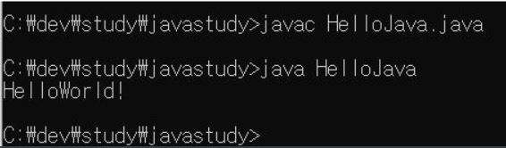
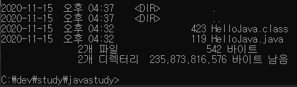
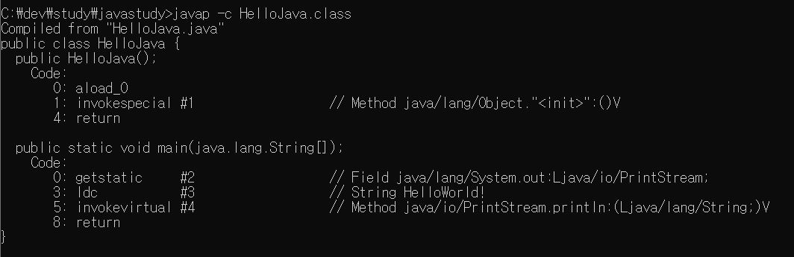

# 목표

- 자바 소스 파일(.java)을 JVM으로 실행하는 과정 이해하기.

# 학습할 것

- JVM이란 무엇인가
- 컴파일 하는 방법
- 실행하는 방법
- 바이트코드란 무엇인가
- JIT 컴파일러란 무엇이며 어떻게 동작하는지
- JVM 구성 요소
- JDK와 JRE의 차이

---

### JVM이란 무엇인가?

JVM : JAVA VIRTUAL MACHINE 자바 가상머신의 약자이다.

JVM은 자바애플리케이션을 클래스 로더를 통해 자바API와 함께 실행시키는 것으로

JAVA와 OS사이에서 중개자 역할을 수행하여 JAVA가 OS에 구애받지않고 재사용을 가능하게 해준다

과거 스타크래프트 게임을 예를 들어보면 윈도우용과 맥용의 패키지를 따로 나누어 판매가 되었었다.

하지만 자바같은 경우는 JVM만 OS에 맞게 설치를 해주면 개발된 프로그램을 OS와 상관없이 JVM이 알아서 

컴파일된 바이트코드를 해석하여 실행하여 준다.

---

### 컴파일 하는 방법

javac (파일이름).java

이렇게하면 컴파일된 바이트코드인 .class파일이 생성이 된다.

오랜만에 cmd창을 열어 java compile을 해보았다...
이렇게 컴파일해본건 몇년만인듯하다...
요즘은 개발은 IDAE로만 하기때문에... 이렇게 컴파일하는 경험은 아무래도 흔치않다..

---

### 실행하는 방법

java (파일이름)

실행방법도 간단하다.

---

### 바이트코드란 무엇인가

javap -c HelloJava.class 명령어를 통하여 class 파일을 열어보았다.

이번에 Java 공부를 통하여 그동안 착각하고 있던 내용을 다시 정리하였다...

자바의 바이트코드는 기계어라고 생각하고 있었지만...(사실 그렇게 배운적이 없는데 언제부터인가 머리속에 그렇게 자리잡고있었다..)

바이트코드는 기계어가 아닌 java의 코드를 컴파일하여 jvm이 읽을수 있도록 번역한 언어라고 보면 되겠다.

1바이트는 256개를 저장가능하듯이 바이트코드는 256개의 명령어를 가지고 있다.

자바의 바이트코드는 JVM이 설치되어 있는 환경이라면 어디서든 실행이 가능하다.

---

### JIT 컴파일러란 무엇이며 어떻게 동작하는지

인터프리터 방식의 단점을 보완하기위해 도입되었다.

인터프리터방식으로 실행하다가 적절한 시점에 바이트코드 전체를 컴파일하여 네이티브 코드로 변경하고 
그후에는 더이상 인터프리팅하지않고 네이티브 코드로 직접 실행하는 방식

네이티브 코드는캐시에 보관 -> 한번 컴파일된 코드는 빠르게 수행하게된다
jit 컴파일러 과정은 바이트코드를 인터프리팅하는것보다 오래걸리므로 한번 실행되는 코드라면 컴파일하지 않고 인터프리팅하는것이 유리

jit컴파일러를 사용하는 JVM들은 내부적으로 해당 메서드가 얼마나 자주 실행되는지 체크하고 일정 정도를 넘을때에만 컴파일수행

---

### JVM 구성 요소

JVM는 크게 3개의 영역으로 구성되어 있다.
1. ClassLoader
2. ExecutionEngine
3. RuntimeDataArea

그럼 처음부터 살펴보자

1. Class Loader
-> JVM내로 .class파일을 로드하고 링크를 통해 배치하는 작업을 수행하는 모듈

2. Execution Engine
->  클래스를 실행시키는 역할
클래스 로더가 JVM의 런타임 데이터 영역에 바이트코드를 배치시키고 이것은 실행엔진에의해 실행된다

바이트코드는 기계가 바로 수행할수 있는 언어보다는 비교적 인간이 보기편한 형태로 기술된것
실행엔진은 이와같은 바이트코드를 실제로 JVM내부에서 기계가 실행할수 있는 형태로 변경하는데
2가지 방식을 사용한다 
- interpreter 인터프리터
- JIT (just in time)

2.3 GC GarbageCollector
GC는 쓰레기 수집가라고 볼수 있다.
객체를 생성하고 사용하다가 더이상 쓸모가 없어진 객체들... 바로 이러한 객체를 찾아서 정리 해주는 역할을 해준다.

3. RuntimeDataArea

프로그램을 수행하기 위해 OS에서 할당받은메모리 공간이다..
이공간은 세부적으로
1) PC Register
2) JVM스택영역
3) Native Method Stack
4) Method Area ( = Class area = Static Area)
5) Heap 영역
으로 구성되어있다.

1) PC Register
쓰레드가 시작될때 생성되며 생성될때마다 생성되는 공간으로 쓰레드마다 하나씩 존재
쓰레드가 어떤부분을 어떤 명령으로 실행해야할 지에 대한 기록을 하는 부분으로 현재 수행중인 JVM명령의 주소를 가진다

2) JVM스택영역
프로그램 실행과정에서 임시로 할당되었다가 메소드를 빠져 나가면 바로 소멸되는 특성의 데이터를 저장하기 위한 영역
각종 형태의 변수나 임시데이터 쓰레드나 메소드의정보를 저장한다.
메소드 호출시마다 각각의 스택프레임이 생성된다
메서드 수행이 끝나면 프레임 별로 삭제
메서드 안에서 사용되는 값을 저장 - 호출된 메소드의 매개변수 , 지역변수, 리턴값 및 연산시 일어나는값을 임시로 저장

3) Native Method Stack
자바 프로그램이 컴파일 되어 생성되는 바이트코드가 아닌 실제 실행할수 있는 기계어로 작성된프로그램을 실행시키는 영역
자바가 아닌 다른언어로 작성된 코드를 위한 공간

Java Native Interface를 통해 바이트코드로 전환하여 저장하게 된다

일반 프로그램처럼 커널이 스택을 잡아 독자적으로 프로그램을 실행시키는 영역이다
이부븐을 통해 C code를 실행시켜 커널에 접근할수 있다.

4) Method Area ( = Class area = Static Area)
클래스 정보를 처음 메모리 공간에 올릴떄 초기화 되는 대상을 저장하기 위한 메모리 공간
올라가게되는 메소드의 바이트코드는 프로그램의 흐름을 구성하는 바이트코드 
자바프로그램은 메인메소드의 호출에서부터 계속된 메소드의 호출로 흐름을 이어간다
인스턴스의 생성도 메소드내에서 명령하고 호출

컴파일된 바이트코드의 대부분이 메소드 바이트코드이기 때문에 거의 모든 바이트코드가 올라간다고 봐도 상관없음

이 공간에는 Runtime ConstantPool 이라는 별도의 관리영역도 함계 존재
-> 상수 자료형을 저장하고 참조, 중복을 막는 역할을 수행

올라가는 정보의 종류
-> field 정보 - 멤버변수의 이름, 데이터타입, 접근 제어자에 대한 정보
-> method 정보 - 메소드의 이름, 리턴타입, 매개변수, 접근 제어자에 대한 정보
-> type 정보 - class인지 interface인지 여부저장 타입의 속성 , 전체이름, superclass의 전체이름

* method area가 클래스 데이터를 위한 공간이라면 heap은 객체를 위한 공간
heap과 마찬가지고 GC관리 대상에 포함

5) Heap 영역

객체를 저장하는 가상 메모리 공간
new 연산자로 생성된 객체와 배열을 저장
물론 class area 영역에 올라온 클래스들만 객체로 생성가능

- Permanent Generation
생성된 객체들의 정보의 주소값이 저장된 공간
ClassLoader 에 의해 load되는 Class, Method등에 대한 Meta정보가 저장되는 영역 JVM에 의해 사용된다
Reflection을 사용하여 동적으로 클래스가 로딩되는 경우에도 사용
Reflection을 자주사용하는 Spring의 경우 이영역에 대한 고려가 필요

- New/Young 영역
Eden : 객체들이 최초로 생성되는 공간
Survivor 0/1 : Eden에서 참조되는 객체들이 저장되는 공간

- Old 영역
newArea에서 일정시간 참조되고 있는 살아남은 객체들이 저장되는 공간Eden영역에 객체가 가득차게 되면 첫번째 GC가 발생한다
Eden영역에 있는 값들을 Survivor1 영역에 복사하고 이영역을 제외한 나머지 영역의 객체를 삭제

인스턴스는 소멸방법과 소멸시점이 지역변수와는 다르기에 힙이라는 별도의 영역에 할당

---

### JDK와 JRE의 차이

JDK : JAVA Developement Kit
JRE : JAVA Runtime Environment

말그래도 JDK는 Java를 개발하기 위한 Kit의 모움이고 JRE는 Java를 실행하기 위한 환경이다.
물론 JDK안에 JRE도 포함되어 있다. 
JRE < JDK

---

1주차 스터디에서는 그동안 개인적으로 정리되어있던 내용을 다시 정리해보고 잘못 알고 있던것을 다시 수정하여 정리하는 시간이였다.
이번 기회를 통해서 나만의 학습 노트를 만들고 정리하는 시간을 가져보도록 해야겠다.

PS. 제가 아직 Markdown언어에 대해 미숙합니다...
이부분 역시 꾸준히 연습하여 깔끔하게 정리해보겠습니다..