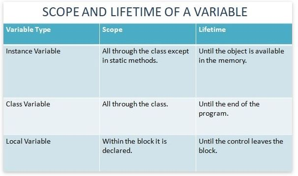
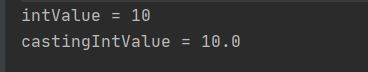
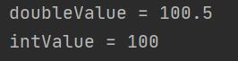

# 목표

 - 자바의 프리미티브 타입, 변수 그리고 배열을 사용하는 방법을 익힙니다.

# 학습할 것

- 프리미티브 타입 종류와 값의 범위 그리고 기본 값

- 프리미티브 타입과 레퍼런스 타입
 
- 리터럴
 
- 변수 선언 및 초기화하는 방법
 
- 변수의 스코프와 라이프타임
 
- 타입 변환, 캐스팅 그리고 타입 프로모션
 
- 1차 및 2차 배열 선언하기
 
- 타입 추론, var

---

### 프리미티브 타입 종류와 값의 범위 그리고 기본 값

자바의 기본형 타입 Primitive Type을 알아보자.

| 종류      | 값의 범위 | 기본값 |
| :------- | :------- | :------- |
| byte | -128 ~ 127 | 0 |
| short | -32,768 ~ 32,767 | 0 |
| int | -2,147,483,648 ~ 2,147,483,647 | 0 |
| long | -9,223,372,036,854,775,808 ~ 9,223,372,036,854,775,807 | 0L |
| float | 1.4E-45 ~ 3.4028235E38 (3.4 * 10^-38  ~ 3.4 * 10^38) | 0.0f |
| double | 4.9E-324 ~ 1.7976931348623157E308 (1.7 * 10^-308  ~ 1.7 * 10^308) | 0.0d |
| char | 0 ~ 65,535 | \u0000 |
| boolean | true/false | false |

[출처] W3SCHOOLS <https://www.w3schools.com/java/java_data_types.asp>

[출처] 블로그 <https://leetaehoon.tistory.com/3>

- '\u0000' : char 에서는 null을 쓰면 컴파일 에러가 난다.
char는 char는 초기화를  '\u0000'으로 사용

---

### 프리미티브 타입과 레퍼런스 타입

- 프리미티브 타입

  - 자바의 프리미티브 타입은 앞서 표로 정리한 자바의 기본형타입이다.
  
  - null이 불가능하고 null을 사용하기 위해서는 WrapperClass를 사용해야한다.
  
  - Stack영역에 저장된다.
  
- 레퍼런스 타입

  - 프리미티브 타입을 제외한 나머지 타입
  
  - null 상태가 가능하다.
  
  - 레퍼런스 타입을 선언만 하게되면 null 상태이며 객체를 new를 사용해서 생성하며 그때서야 해당 변수에 객체의 주소값이 셋팅된다. 
  
  - 레퍼런스 타입은 Heap영역에 저장된다.
    
---
 
### 리터럴

- 리터럴에 대해 찾아보다가 어떻게 정리를 해야할지 고민을 많이했다...

<pre>
 인터넷을 찾아보면 int a = 1;  1이 리터럴이다....  이렇게 많이 나온다
</pre>

- 그래서 내린 결론은....

- 자바의 프리미티브타입에 바로 초기화하는 값 그 자체가 리터럴 이라고 정리를 하였다.

<pre>
int intTypeValue = 1;
long longTypeValue = 1L;
float floatTypeValue = 1.0f;
double doubleTypeValue = 1.0;
char charTypeValue = 'a';
boolean booleanTypeValue = true;
String stringTypeValue = "String";
</pre>

---

### 변수 선언 및 초기화하는 방법

<pre>
int declaredValue;   // 변수를 선언
declaredValue = 10;  // declaredValue 변수에 10으로 초기화
</pre>

변수를 선언하는 방법은 선언할 변수의 타입과 변수명을 지정하면 된다.
이렇게하면 메모리에 데이터를 저장한 장소를 지정하게된다.

그리고 이후에 해당 변수를 10으로 초기화 하게되면 그때 데이터를 저장할 공간에 10의 값을 저장하게된다.

---

### 변수의 스코프와 라이프타임

<pre>
public class VariableExample {

    int instanceVariable = 1000; // 인스턴스변수
    static int classVariable = 999; // 클래스변수
    
    public void methoc() {
        int localVariable = 10; // 지역변수
    }
}
</pre>

변수의 타입은 3종류
- 인스턴스변수
  - Scope : static 메소드를 제외한 해당 클래스안에서 존재
  - lifetime : 메모리에서 해당 클래스가 존재하는 동안
  
- 클래스변수
  - Scope : 해당 클래스안에서 존재
  - lifetime : 프로그램이 종료될때까지

- 지역변수
  - Scope : 선언된 블록안에서 존재 -> 중괄호 { }  이 범위안에서 존재
  - lifetime : 선언된 블록(중괄호의 범위내)에서 살아 있다

[출처] learningjournal.guru <https://www.learningjournal.guru/article/programming-in-java/scope-and-lifetime-of-a-variable/>

---

### 타입 변환, 캐스팅 그리고 타입 프로모션

- 자동형변환이란?
자동형변환은 어떤 자료형이 다른 자료형으로 자동으로 데이터 타입이 변경되는것을 말한다.
예를 들어
<pre>
int intValue = 10;
System.out.println("intValue = " + intValue);

double castingIntValue = intValue;
System.out.println("castingIntValue = " + castingIntValue);
</pre>
위와 같은 코드에서 처음에 intValue에 10으로 초기화를 한뒤 이 값을 double형인 castingIntValue변수에 넣어보자

결과는 다음과 같다

10이라는 정수가 10.0 으로 변경되었다.
이런것이 자동형변환이다.

<pre>
byte(1) < short(2) < int(4) < long(8) < float(4) < double(8)
</pre>
자동형변환은 다음과 같은 순서로 작은것부터 큰것으로 변환된다.

단 long에서 float은 예외인데...
이유는 
long : -9,223,372,036,854,775,808 ~ 9,223,372,036,854,775,807 
float : 3.4 * 10^-38  ~ 3.4 * 10^38
float의 데이터 표현범위가 더 크기 때문에 float이 더 큰타입으로 들어간다.  

- 강제형변환
강제형변환은 말그대로 강제로 데이터형을 변환하는것이다.
<pre>
double doubleValue = 100.5;
System.out.println("doubleValue = " + doubleValue);
int intValue = doubleValue; // 컴파일 에러
</pre>
double이 데이터 크기가 더 크기때문에 컴파일 에러가 발생한다.

강제형변환 하는 방법은 변환할 자료형타입을 지정해주면된다.
<pre>
double doubleValue = 100.5;
System.out.println("doubleValue = " + doubleValue);
int intValue = (int) doubleValue; 
</pre>
double형인 doubleValue를 int로 형변환한다고 명시해주면 int형으로 변환한다. 

---
 
### 1차 및 2차 배열 선언하기

---
 
### 타입 추론, var