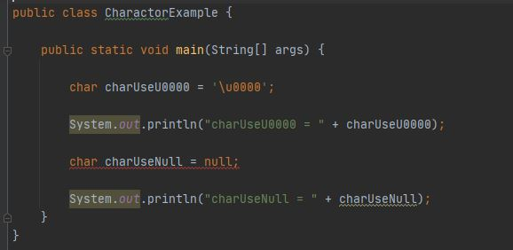

# 목표

 - 자바의 프리미티브 타입, 변수 그리고 배열을 사용하는 방법을 익힙니다.

# 학습할 것

- 프리미티브 타입 종류와 값의 범위 그리고 기본 값

- 프리미티브 타입과 레퍼런스 타입
 
- 리터럴
 
- 변수 선언 및 초기화하는 방법
 
- 변수의 스코프와 라이프타임
 
- 타입 변환, 캐스팅 그리고 타입 프로모션
 
- 1차 및 2차 배열 선언하기
 
- 타입 추론, var

---

### 프리미티브 타입 종류와 값의 범위 그리고 기본 값

자바의 기본형 타입 Primitive Type을 알아보자.

| 종류      | 값의 범위 | 기본값 |
| :------- | :------- | :------- |
| byte | -128 ~ 127 | 0 |
| short | -32,768 ~ 32,767 | 0 |
| int | -2,147,483,648 ~ 2,147,483,647 | 0 |
| long | -9,223,372,036,854,775,808 ~ 9,223,372,036,854,775,807 | 0L |
| float | 1.4E-45 ~ 3.4028235E38 (3.4 * 10^-38  ~ 3.4 * 10^38) | 0.0f |
| double | 4.9E-324 ~ 1.7976931348623157E308 (1.7 * 10^-308  ~ 1.7 * 10^308) | 0.0d |
| char | 0 ~ 65,535 | \u0000 |
| boolean | true/false | false |

[출처] W3SCHOOLS <https://www.w3schools.com/java/java_data_types.asp>
[출처] 블로그 <https://leetaehoon.tistory.com/3>

- '\u0000' : char 에서는 null을 쓰면 컴파일 에러가 난다.
char는 char는 초기화를  '\u0000'으로 사용

### 프리미티브 타입과 레퍼런스 타입

- 프리미티브 타입

- 레퍼런스 타입