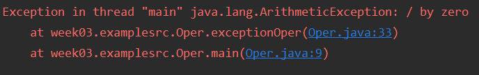

# 목표

자바가 제공하는 다양한 연산자를 학습하세요.

# 학습할 것

- 산술 연산자
- 비트 연산자
- 관계 연산자
- 논리 연산자
- instanceof
- assignment(=) operator
- 화살표(->) 연산자
- 3항 연산자
- 연산자 우선 순위
- (optional) Java 13. switch 연산자

---

### 산술 연산자

산술 연산자는 초등학교때 배웠던 사칙연산이다.

거기에 나머지가 추가되었다

| 종류 | 내용   |
| :--- | :---   |
|  +   | 더하기 |
|  -   | 빼기   |
|  *   | 곱하기 |
|  /   | 나누기 |
|  %   | 나머지 |

<pre>
int firstNum = 12;
int secondNum = 4;

System.out.println(firstNum + " + " + secondNum + " = "+ (firstNum + secondNum));
System.out.println(firstNum + " - " + secondNum + " = "+ (firstNum - secondNum));
System.out.println(firstNum + " * " + secondNum + " = "+ (firstNum * secondNum));
System.out.println(firstNum + " / " + secondNum + " = "+ (firstNum / secondNum));
System.out.println(firstNum + " % " + secondNum + " = "+ (firstNum % secondNum));
</pre>

12 와 4의 각 사칙연산을 해보면 다음과 같다

12 와 5의 나누기후 나머지
<pre>
int firstNum = 12;
int secondNum = 5;
System.out.println(firstNum + " % " + secondNum + " = "+ (firstNum % secondNum));
</pre>

만약 어떤수를 0으로 나눌경우 컴파일에러는 발생안하지만 실행중 다음과같은 Exception이 발생한다.

다음은 정수형과 실수형에따른 나눗셈을 확인해보자
<pre>
int intVal1 = 9;
int intVal2 = 4;
float floatVal1 = 9.0f;
float floatVal2 = 4.0f;
System.out.println(intVal1 + " / " + intVal2 + " = "+ (intVal1 / intVal2));
System.out.println(floatVal1 + " / " + floatVal2 + " = "+ (floatVal1 / floatVal2));
System.out.println("(float) "+intVal1 + " / " + intVal2 + " = "+ ((float) intVal1 / intVal2));
</pre>
3번째의 나눗셈을 보면 intVal1의 9 값은 float로 형변환되어 9.0f가 된다

그리고 9.0f/4가되어 나눗셈은 실수형의 결과가 나온다

추가적으로 실수를 나눈후 나머지를 확인해보자

실수를 %연산으로 하면 결과가 이상하게 출력되는것을 확인할수 있다.

실수형 나눗셈은 문제가 있다.
자바에서는 컴파일도 가능하고 실행도 되지만 일부 언어에서는 실수의 %연산을 허용하지 않는 언어도 있다고 한다.

 ---
 
### 비트 연산자

비트연산자는 비트단위로 연산을 진행하는 연산자 이며, 피연산자는 반듯이 정수여야한다.
실수의 비트연산은 불가능하다

| 연산자 | 연산자의 기능   |
| :--- | :---   |
|  &   | 'n1 & n2' &nbsp; 비트단위로 AND연산을 한다,  |
|  &#124; | 'n1 &#124; n2' &nbsp; 비트단위로 OR연산을 한다,   |
|  ^   | 'n1 ^ n2' &nbsp; 비트단위로 XOR연산을 한다, |
|  ~   | '~n' &nbsp; 모든 비트를 반전시켜서 얻은 결과를 반환 |

비트 연산자를 이용하여 연산한 결과를 보자

 비트쉬프트 연산자는 피연산자의 비트열을 왼쪽 또는 오른쪽으로 이동시키는 연산자 이다.
 - <<  의 경우 비트열을 왼쪽으로 이동하고 빈공간은 0으로 채운다
 - &gt;&gt; 의 경우 비트열을 오른쪽으로 이동하고 음수의 경우 1, 양수의 경우 0으로 채운다.
 - &gt;&gt;&gt; 의 경우 비트열을 오른쪽으로 이동하고 빈공간을 0으로 채운다.
 

 ---
 
### 관계 연산자

관계 연산자는 크기 및 동등관계를 따시는 연산자 이다.

| 연산자 | 연산자의 기능   |
| :--- | :---   |
|  <   | 'n1 < n2' &nbsp; n1이 n2보다 작은가?  |
|  &gt;   | 'n1 > n2' &nbsp; n1이 n2보다 큰가?   |
|  <=   | 'n1 <= n2' &nbsp; n1이 n2보다 같거나 작은가? |
|  >=   | 'n1 >= n2' &nbsp; n1이 n2보다 같거나 큰가? |
|  ==   | 'n1 == n2' &nbsp; n1과 n2가 같은가? |
|  !=   | 'n1 != n2' &nbsp; n1과 n2가 다른가? |

 ---
 
### 논리 연산자

논리연산자 도 true/false를 반환하는 연산자로써 and, or, not 을 의미하는 연산자로 구성되어있다. 

| 연산자 | 연산자의 기능   |
| :--- | :---   |
|  &&   | 'a && b' &nbsp; a와 b가 모두 true 면 true  |
|  ||   | 'a && b' &nbsp; a와 b가 둘중 하나라도 true 면 true   |
|  !   | '!a' &nbsp; a가 true면 false, false면 true |

논리연산의 결과를 표로 정리해보자

| 피연산자1 (OP1) | 피연산자2 (OP2) | 연산결과 (OP1 && OP2)  |
| :--- | :--- | :--- |
| ture | ture | ture |
| ture | false | false |
| false | ture | false |
| false | false | false |
&& And연산의 결과

| 피연산자1 (OP1) | 피연산자2 (OP2) | 연산결과 (OP1 &#124;&#124; OP2)  |
| :--- | :--- | :--- |
| ture | ture | ture |
| ture | false | ture |
| false | ture | ture |
| false | false | false |

'||' OR연산의 결과

| 피연산자(OP) | 연산결과 (!OP)  |
| :--- | :--- | 
| ture | false | 
| false | ture |

 ---
 
### instanceof

객체의 타입을 확인하는데 사용한다.

이 과정에서 형변환이 가능하면 true를 형변환이 불가능하면 false를 반환한다.

그리고 자기자신이면 역시 true를 반환한다.

예제코드를 통하여 확인해보자
<pre>
class A {
}
class B extends A {
}

.....

A a = new A();
B b = new B();

if(a instanceof A) {
    System.out.println("a instanceof A : "+ (a instanceof A));
    System.out.println("a는 자기 자신이기 때문에 true");
}

if(b instanceof A) {
    System.out.println("b instanceof A : "+ (b instanceof A));
    System.out.println("b는 A의 자식 클래스이기 때문에 형변환 가능 : true");
}

if(a instanceof B) {
    System.out.println("불가능!");
} else {
    System.out.println("a instanceof B : "+ (a instanceof B));
    System.out.println("a는 B의 붐 클래스이기 때문에 형변환 불가능 : false");
}
....
</pre>

A클래스와 A를 상속받은 B클래스로 테스트를 해보면 결과는 다음과 같다

 ---
 
### assignment(=) operator

- 대입연산자

assignment 연산자는 =이다.

즉 지금까지 데이터를 초기화 할떄 사용하던 연산자다.

자바에서는 오른쪽에 있는 피연산자를 변수에 값을 저장 또는 구글번역에서 나온 뜻대로 값을 할당하기 위해 사용하는 연산자이다

- 복합대입연산자

복합대입연산자는 말 그대로 복합하여 대입한다.
즉 다른연산자와 묶여서 정의된 연산자이다

 ---
 
### 화살표(->) 연산자

Java 8 버전에서 추가된 특징은
Stream API, Optional, 람다식....등등...
화살표 연산자는 Java가 람다식을 지원하면서 추가된 연산자이다..

사용방법은 다음과같다.
> (매개변수) -> {처리내용}

<pre>
@FunctionalInterface
interface Calc {
    public int min(int x, int y);
}

public class Lambda {

    public static void main(String[] args) {

        // 람다식 사용전
        Calc calc = new Calc() {
            @Override
            public int min(int x, int y) {
                return x < y ? x : y;
            }
        };

        System.out.println(calc.min(5,6));
        
        // 람다식 사용
        Calc minNum = (x , y) -> x < y ? x : y;
        System.out.println(minNum.min(3,4));
        
    }
}
</pre>
람다식을 사용하게되면 실제 여러줄에 나눠서 구현을 해줘야하는 내용을 단순하게 표현할수있다

솔직히... 실제 프로젝트를 하면서 아직 람다식을 자주 쓰지 않아.. 언제 써야하는지는 잘 느낌이 오질 않는다...
이부분은 좀더 예제를 찾아보고 사용해봐야겠다.

[출처] TCPSchool.com <http://www.tcpschool.com/java/java_lambda_concept>

 ---
 
### 3항 연산자

3항 연산자는 if~else를 다르게 표현하는 방법이다.

- if~else사용
> if(조건문) {
>
> 참일때
>
> } else {
>
> 거짓일때
>
> }

- 3항 연산자 사용
>  (조건문) ? 참일때 : 거짓일때

 ---
 
### 연산자 우선 순위

연산자의 우선순위를 보다보니.... 내용이 너무 긴거같아서.. 사진으로 일단대처를 하였다..

> 표를보면 ' 결합방향' 과 '우선순위'에 대한 정보를 볼 수 있는데, 
> 이들은 하나의연산식 안에 둘 이상의 연산자가 존재하는 경우의 연산 진행순서를 결정하는 요소들이므로....

책에 이런 내용이 있었다.. 우리가 수학을 할때도 덧셈, 뺼셈보다 곱셈, 나눗셈을 먼저 하듯이 
자바에서도 연산자의 순서가 있다.
바로 그 순서가 우선순위인것이다.

동일한 연산자가 하나의 연산식안에 둘이상 놓여있을떄 연산의 순서를 결정짓는 요소이다.

 ---
 
### (optional) Java 13. switch 연산자

- 기존 switch~case문
<pre>
int a = 10;

switch (a){
    case 10 :
        System.out.println("10");
        break;
    case 20 :
        System.out.println("20");
    default:
        System.out.println("default");
}
</pre>

자바 12 버전 이전의 switch~case문법은
switch의 조건문과 값이 일치하는 case의 내용을 실행하였다.

하지만 12버전 이후의 자바는 switch~case문법에서 break값으로 값을 반환할수 있다.
<pre>

int result = switch (type) {
    case "a":
    case "b":
        break 1;
    case "c":
        break 2;
    default:
        break 3;
};
</pre>

하지만 13버전 에서는 break대신 yield를 사용하도록 변경되었다.
<pre>
int result = switch (type) {
    case "a","b":
        yield 1;
    case "c":
        yield 2;
    default:
        yield 3;
};
</pre>

그리고 swtich~case문에서 화살표 함수를 사용할수 있도록 바뀌었다.
<pre>
int result = switch (type) {
    case "a","b" -> 1;
    case "c" -> 2;
    default:
        yield 3;
};
</pre>

그저 if~else문과 비슷한 용도의 switch문이 이렇게 바뀐지 처음알게되었다...

이번 자바 스터디를 통하여 기본도 다시 정리를 하지만 새로운내용도 많이 배우는 좋은 경험이 되는것 같다..

[출처] Mkyoung.com <https://mkyong.com/java/java-13-switch-expressions/>

 ---

3주차 과제 참조

[출처] 난 정말 JAVA를 공부한 적이 없다구요 - 윤성우 저 
