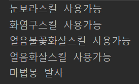

# 목표

자바가 제공하는 제어문을 학습하세요.

# 학습할 것

- 선택문
- 반복문

---

### 선택문
Java에서 선택문의 종류는 if~eles 와 switch~case문 2개가 있다.

그럼 먼저 if~else부터 알아보자
 
 - if~else
 > if 만약 @@ 한다면.. 떙떙 할것이다....

중고등학교 다닐때 영어시간에 많이 듣던 말이다..
그렇다... Java에서도 동일하다.
<pre>
if( 조건문 ) {
    조건이 참일때 실행
} else {
    조건이 거짓일때 실행
}
</pre>
예시
<pre>
if( 1 > 0 ) {
    System.out.println("1은 0보다 크다! 참!");
} else {
    System.out.println("1은 0보다 크지 않다!");
}
</pre>

사용법은 참 간단하다.
이전시간에 학습하였던 삼항연산자랑 비슷하다

하지만 차이점은
<pre>
if( 1 > 0 ) {
    System.out.println("1은 0보다 크다! 참!");
    System.out.println("if 문 단독으로도 사용가능!");
} 
</pre>

if문이 단독으로도 사용이 가능하다.
이뿐이 아니다..

<pre>
int mathScore = 85;
if( mathScore >= 90 ) {
    System.out.println("수학점수는 90점 이상!");
} else if (mathScore >= 80) {
    System.out.println("수학점수는 80점 이상!");
} else if (mathScore >= 70) {
    System.out.println("수학점수는 70점 이상!");
} else if (mathScore >= 60) {
    System.out.println("수학점수는 60점 이상!");
} else {
    System.out.println("그 외 점수!");
}
</pre>

이렇게 
<pre>else if (조건문)</pre> 
을 추가함으로서 여러 조건을 추가할수 있다.

- switch~case

switch~case문 역시 if~else문과 비슷한 역할을 한다.

switch~case문의 간단한 예제를 통해 살펴보자
<pre>
String season = "winter";
switch (season) {
    case "Spring" :
        System.out.println("봄이다");
        break;
    case "Summer" :
        System.out.println("여름이다");
        break;
    case "Autumn":
        System.out.println("가을이다");
        break;
    case "Winter":
        System.out.println("겨울이다");
        break;
    default:
        System.out.println("어느행성사람이냐?");
}
</pre>

느낌이 올것이다.
switch()
<pre>
switch( 조건 ) {
    case A:  // 조건이 A와 일치할떼 
        .....
        break;
    case B: // 조건이 B와 일치할때
        .....
        break;
    default : // 위의 조건과 일치하지 않을때 기타
        .....
}
</pre>

if문에서 else if를 통하여 여러 조건을 추가하였다면 switch case문에서는 case를 추가하여 조건을 추가할수 있다.
그리고 break;를 선언함으로서 해당 조건에서 switch문은 종료가 된다.

그럼 만약 break를 명시안하면 어떻게될까?

한번해보자

<pre>
int level = 40;
switch (level){
case 50:
    System.out.println("비전탄막스킬 사용가능");
case 40:
    System.out.println("눈보라스킬 사용가능");
case 30:
    System.out.println("화염구스킬 사용가능");
case 20:
    System.out.println("얼음불꽃화살스킬 사용가능");
case 10:
    System.out.println("얼음화살스킬 사용가능");
default:
    System.out.println("마법봉 발사");
}
</pre>

break를 사용안하면 해당 조건부터 그 이후의 조건은 다처리된다. 

---

### 반복문

Java의 반복문은 while , do~while, for 이렇게 3종류가 있다

- while문
<pre>
while(반복조건) {
    반복영역
}
</pre>

while문은 반복조건의 검사 -> 반복영역 실행 -> 다시 반복조건 검색 -> 반복영역실행....
이순서대로 진행이된다.

> 정리
> 1. 반복조건을 먼저 감사 한 후에 반복영역의 실행여부를 결정한다.
> 2. 반복조건을 먼저 검사하기 때문에 반복영역이 한 차례도 실행되지 않을 수 있다.

- do~while문
<pre>
do {
    반복영역
} while(반복조건)
</pre>

차이점이 보이는가. do~while은 먼저 1번을 실행한후 그이후에 조건을 검사하고 다시 반복하는것이다...
반복영역 실행 -> 반복조건 검사 -> true면 반복영역 실행 -> 반복조건 검사 -> true면....

> 정리
> 1. 반복영역을 먼저 실행 한 다음에 반복조건을 검사한다.
> 2. 반복영역을 먼저 실행하기 깨문에, 반복조건을 만족하지 않더라도 한 차례는 실행된다. 

