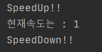

# 목표

자바의 Class에 대해 학습하세요.

# 학습할 것

- 클래스 정의하는 방법
- 객체 만드는 방법 (new 키워드 이해하기)
- 메소드 정의하는 방법
- 생성자 정의하는 방법
- this 키워드 이해하기

---

### 클래스 정의하는 방법

클래스는 어떤 객체를 만들기 위한 틀이다.
예를 들면 자동차를 객체로 만들기 위해서는
자동차의 상태를 관리하는 변수와 자동차의 행위를 담당하는 메소드가 모두 포함된 틀 이것이 클래스이다.

클래스를 정의하기 위해서는 class 키워드와 클래스명 그리고 {} 를 이용하면된다

<pre>
class 클래스명 {
}
</pre>

<pre>
public class Car {
    
    int speed;
    String name;
    
    public Car(String name) {
        this.speed = 0;
        this.name = name;
    }
    
    public void speedUp() {
        speed++;
    }

    public void speedDown() {
        if(speed < 1) {
            speed = 0;
            return;
        }
        speed--;
    }
}
</pre>

클래스는 크게 3부분으로 볼수 있다.
- 멤버변수
    - 클래스 내부에서 관리되는 변수로 자동차를 예를들면 차량의 이름이나 현재 속도 등 상태값을 나타낸다. 
- 생성자
    - 앞서 클래스를 어떤 객체를 만들기위한 틀이라고 설명했다. 생성자는 그 틀에 필요한 값을 받아서 객체를 생성해 주는 역할을 한다.
- 메서드
    - 해당 객체가 자신의 하고자 하는 행동을 구현한 기능이다.
    
그리고 인스턴스 변수 또는 메소드 앞에 접근제어자를 선언을 할수가 있다.

| 종류 | 범위 | 
| :--- | :--- |
| private | 동일한 클래스내에서만 접근가능 |
| default(생략가능) | 동일한 패키지내에서만 접근가능 |
| protected | 동일 패키지 또는 상속받은 패키지의 클래스에서 접근가능 |
| public | 어떤 클래스에서도 모두 접근가능 |

[출처] <https://wikidocs.net/232>

---

### 객체 만드는 방법 (new 키워드 이해하기)

객체를 만드는 방법은 다음과 같다
<pre>
클래스명 변수명 = new 클래스명(); 

또는

클래스명 변수명 = new 클래스명(파라미터); 
</pre>

클래스를 타입으로 하는 변수를 선언한 후 new 키워드를 이용하여 객체를 만들어 준다.
만약 해당 클래스의 기본생성자가 없고 생성자에 파라미터를 통하여 값을 전달받을 경우는 해당 파라미터도 같이 넘겨 준다.

<pre>
public class Car {
    
    int speed;
    String name;
    
    public Car(String name) {
        this.speed = 0;
        this.name = name;
    }
    
    public void speedUp() {
        speed++;
    }

    public void speedDown() {
        if(speed < 1) {
            speed = 0;
            return;
        }
        speed--;
    }
}
</pre>

이것을 예로보자.

<pre>
Car car = new Car("MyCar");
</pre>

Car라는 타입을 가진 car의 변수에 new Car("MyCar");를 통하여 객체를 생성한다.
이때 MyCar라는 차량의 이름을 넘겨받고 Heap에 speed와 name을 저장할수 있는 메모리를 할당받는다.
그리고 이 스택에 car 영역을 만들고 여기에 Heap에 할당된 메모리 주소를 저장한다.

[출처] <https://ejfrmjava.tistory.com/65>

---

### 메소드 정의하는 방법

메소드는 해당 객체가 자신의 하고자 하는 행동을 구현한 기능이다 라고 앞서 정리 하였다.

그리고 메소드는 인스턴스변수와 마찬가지로 접근제어라를 명시할수 있다.

| 종류 | 범위 | 
| :--- | :--- |
| private | 동일한 클래스내에서만 접근가능 |
| default(생략가능) | 동일한 패키지내에서만 접근가능 |
| protected | 동일 패키지 또는 상속받은 패키지의 클래스에서 접근가능 |
| public | 어떤 클래스에서도 모두 접근가능 |

<pre>
class 클래스 {
...
    접근제어가 반환타입 메소드명(파라미터...) {
        return 반환타입;
    }
...
}
</pre>

<pre>
class Car {

    int speed;
    String name;

    public Car(String name) {
        this.speed = 0;
        this.name = name;
    }

    public void speedUp() {
        speed++;
        System.out.println("SpeedUp!!");
    }

    public void speedDown() {

        if(speed < 1) {
            speed = 0;
            System.out.println("Stop!!");
            return;
        }
        speed--;
        System.out.println("SpeedDown!!");
    }

    public void nowSpeed() {
        System.out.println("현재속도는 : "+speed);
    }
}

public class Race {

    public static void main(String[] args) {
        Car car = new Car("MyCar");

        car.speedUp();
        car.nowSpeed();
        car.speedDown();
    }
}
</pre>

Car의 객체를 생성한다.
> Car car = new Car("MyCar"); 

생성된 객체의 메소드 호출은 해당 객체의 변수.메소드명() 으로 호출한다.

<pre>
메소드 호출
car.speedUp();
car.nowSpeed();
car.speedDown();

구현한 메소드내용
public void speedUp() {
    speed++;
    System.out.println("SpeedUp!!");
}

public void speedDown() {

    if(speed < 1) {
        speed = 0;
        System.out.println("Stop!!");
        return;
    }
    speed--;
    System.out.println("SpeedDown!!");
}

public void nowSpeed() {
    System.out.println("현재속도는 : "+speed);
}
</pre>

호출결과는 다음과 같다.

---

### 생성자 정의하는 방법

생성자를 정의하는 방법은 메소드정의하는 방법과 매우 유사하다.

하지만 반환타입이 없다는 점이 다르다.

생성자는 따로 선언하지 않으면 기본 default생성자로 생성이되며

따로 생성자를 선언하여 사용할수 있다.
<pre>
class 클래스 {
...
    접근제어가 클래스(파라미터...) {
        
    }
...
}
</pre>

생성자는 해당 클래스가 객체로 생성될때 클래스가 가진 인스턴스 변수를 초기화 할수 있다.
 
생성자를 정의할때는 생성자의 이름은 클래스 명과 동일하게 선언해야한다.

<pre>
class Car {

    private int speed;
    private String name;
    
    public Car(String name) {
        this.speed = 0;
        this.name = name;
    }
    
    public Car(int speed, String name) {
        this.speed = speed;
        this.name = name;
    }
...
}
</pre>

그리고 메소드와 마찬가지고 생성자 역시 오버로딩이 가능하다

---

### this 키워드 이해하기

자바에서 this 키워드는 자기 자신을 가리킨다.
과거 변수의 생존범위는 {} 중괄호 라고 정리 한적이 있다.
그렇다면 다음 예제를 보자
 
<pre>
class Car {

    private int speed;
    private String name;
    
    public Car(int speed, String name) {
        this.speed = speed;
        this.name = name;
    }
...
}
</pre>

생성자의 파라미터로 받은 speed는 와 인스턴스변수의 speed 이 두 변수의 이름은 같다.
그렇다면 생성자는 어떤게 객체의 인스턴스변수를 가르키는 speed인지 어떻게 구분할까 바로 this이다.
변수 앞에 this를 붙여주면 해당 객체의 인스턴스 변수를 의미하게 된다.

this에 대해 알아보기 위해 검색해보던중 this()를 발견하였다..
뭔가 엄청 낯설다....

과거에 봤던 책을 펴서 this에 대해 찾아보았다..
읽었던 흔적이있다... (이럴수가...)

뭐 평소잘 사용을 하지않아서 잊어먹은거라 생각한다..

this() .. 소괄호() 가 있는 것이 생성자 또는 메소드의 형태와 비슷하다.

그렇다 this()는 생성자를 호출하는 키워드이다

예제를 통해 알아보자.

<pre>
class Car {

    private int speed;
    private String name;
    
    public Car(String name) {  // name을 파라미터로 받는 생성자
        this(0, name);    // 자기자신의 생성자를 호출한다 파라미터는 2개
    }
    
    public Car(int speed, String name) {
        this.speed = speed;
        this.name = name;
    }
...
}
</pre>

this를 통하여 자기자신의 다른 생성자를 호출할수 있음을 알수가 있다. 

---

5주차 과제 참조

[출처] 난 정말 JAVA를 공부한 적이 없다구요 - 윤성우 저 

