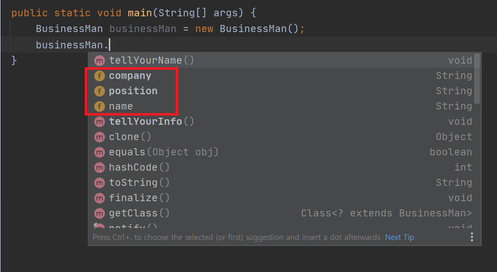
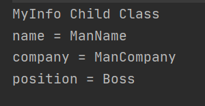
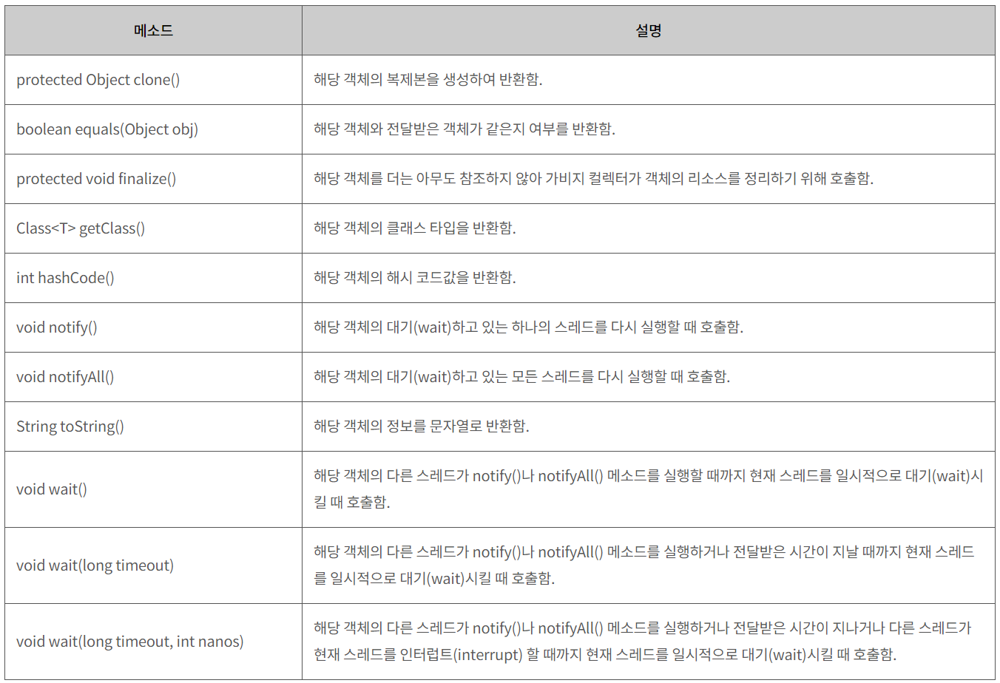

# 목표

자바의 상속에 대해 학습하세요..

# 학습할 것

- 자바 상속의 특징
- super 키워드
- 메소드 오버라이딩
- 다이나믹 메소드 디스패치 (Dynamic Method Dispatch)
- 추상 클래스
- final 키워드
- Object 클래스

---

### 자바 상속의 특징

상속은 기존에 정의된 클래스에 메소드와 변수를 추가하여 새로운 클래스를 정의하는 것이다
<pre>
public class Man {

    public String name;

    public void tellYourName() {
        System.out.println("name = " + name);
    }
}

public class BusinessMan extends Man {

    public String company;
    public String position;

    public void tellYourInfo() {
        System.out.println("company = " + company);
        System.out.println("position = " + position);
        tellYourName();
    }
}

</pre> 

다음은 상속을 이용한 예이다.
extends 키워드는 상속을 하기 위한 키워드이며,
extends Man은 BusinessMan클래스에서 Man클래스를 상속한다는 의미이다.
 
 
 
 BusinessMan 인스턴스를 생성하면 Man의 클래스에 정의된 메소드와 변수가 존재한다는걸 알수가 있다.
 
> 클래스 Man         -> 상위클래스, 기초클래스
>
> 클래스 BusinessMan -> 하위클래스, 유도클래스
 
---

### super 키워드

상위 클래스의 생성자를 호출 하는 방법은 super이다

<pre>
public class BusinessMan extends Man {
    ...
    public BusinessMan(String name, String company, String position) {
        super(name);
        this.company = company;
        this.position = position;
    }
    ...
}
</pre>

BusinessMan의 생성자에서 super(name) 을 호출하고 있다.
이것은 바로 상위 클래스인 Man의 생성자를 호출하는것이다.

<pre>
public class Man {
...
    public Man(String name) {
        this.name = name;
    }
...
}
</pre>

이렇게 상위 클래스의 생성자를 호출하기 위해서 super를 사용한다.

<pre>
public class Man {
...
    public Man() {
    }

    public Man(String name) {
        this.name = name;
    }
...
}
</pre>

만약 이렇게 기본 생성자가 존재한다면

<pre>
public class BusinessMan extends Man {
...
    public BusinessMan(String name, String company, String position) {
//        super(name);
        this.company = company;
        this.position = position;
    }
...
}
</pre>

super의 호출은 생략해도 된다.
하지만 기본생성자가 없다면 초기화를 해주어야한다.

---

### 메소드 오버라이딩

메소드 오버라이딩은 상위클래스에 정의되어있는 메소드를 하위클래스에서 재정의하여 사용하는것이다.
 
<pre>
public class Man {
...
    public void myInfo() {
        System.out.println("MyInfo Parent Class");
        System.out.println("name = " + name);
    }
}
</pre>
<pre>
public class BusinessMan extends Man {
...
    @Override
    public void myInfo() {
        System.out.println("MyInfo Child Class");
        System.out.println("name = " + name);
        System.out.println("company = " + company);
        System.out.println("position = " + position);
    }
}
</pre>

예시를 보면 Man클래스에서 myInfo() 메소드에서 자신의 이름을 출력하고 있다.

BusinessMan클래스에서 myInfo() 메소드를 재정의하여 이름과 회사, 직위를 출력하고 있다.
  
 
 
 myInfo의 재정의 결과는 다음과 같다.
 
---

### 다이나믹 메소드 디스패치 (Dynamic Method Dispatch)

디스패치란 프로그램이 어떤 메소드를 호출할 것인가를 결정하여 그것을 실행하는 과정을 말한다.

- Static Dispatch
<pre>
public class Dispatch {

    void run(){
        System.out.println("run");
    }

    void run(String msg){
        System.out.println(msg);
    }

    public static void main(String[] args) {
        Dispatch dispatch = new Dispatch();
        dispatch.run();
    }
}
</pre>
이 예시를 실행하면 Dispatch 클래스에 정의된 run 메소드중 어느 것이 실행될지는 컴파일 시점에서 알수가 있다.

- Dynamic Dispatch
<pre>
abstract class Dynamic {
    abstract void run();
}
class Dynamic1 extends Dynamic {
    void run(){
        System.out.println("Dynamic1.run");
    }
}

class Dynamic2 extends Dynamic {
    void run(){
        System.out.println("Dynamic2.run");
    }
}

public class Dispatch {

    public static void main(String[] args) {
        Dynamic dynamic = new Dynamic1();
        dynamic.run();
    }
}
</pre>
이 예시를 실행하면 어떤 클래스의 run 메소드가 실행될지는 컴파일 시점에서는 알수 없다.
하지만 실행해보면 Dynamic1.run 가 출력되는것을 알수가 있다.
이때 다이나믹 디스패치가 일어난다.

[출처] <https://feco.tistory.com/86>

---

### 추상 클래스

추상클래스 abstract 클래스는 완전하지 않은 클래스를 의미한다.
즉 인스턴스 생성이 불가능한 클래스이다.

추상클래스는 인스턴스의 생성이 불가능하다는 점만 제외하면 모든 부분에서 일반 클래스와 동일하다.

<pre>
public abstract class AAA {

    void methodOne() {
        System.out.println("AAA.methodOne");
    }
    abstract void methodTwo();
}
</pre>

<pre>
public class BBB extends AAA {

    void methodThree() {
        System.out.println("BBB.methodThree");
    }

//   @Override
//   void methodTwo() {
//       System.out.println("BBB.methodTwo");
//   }
}
</pre>

추상클래스를 상속받는 하위 클래스는 상위 클래스 내부에 있는 abstract 메소드를 재정의해야한다.
그렇지 않으면 인스턴스의 내부에 abstract 가 포함된 상태라 인스턴스생성이 불가능하다.

---

### final 키워드

final 키워드는 변수나 메소드 클래스가 한번 초기화되면 다시 변경이 안되도록 막는것이다.

- final Class
클래스의 수정을 막는다?
즉 final Class 는 상속을 통하여 해당 클래스를 재사용 할수 없음을 의미한다.
 
 

- final Method
메소드에 final을 선언하게되면 해당 메소드는 하위메소드에서 재정의하여 사용이 불가능하다는것을 의미한다.

[출처] <https://gmlwjd9405.github.io/2018/08/06/java-final.html>

---

### Object 클래스

Object 클래스는 모든 자바 클래스의 최고 조장 클래스가 된다.
자바의 모든 클래스는 Object 클래스의 모든 메소드를 바로 사용할수 있다.
Object의 메소드는 다음과 같은 11개의 메소드를 가지고 있다.

[출처] <http://www.tcpschool.com/java/java_api_object>

---

6주차 과제 참조

[출처] 난 정말 JAVA를 공부한 적이 없다구요 - 윤성우 저 

