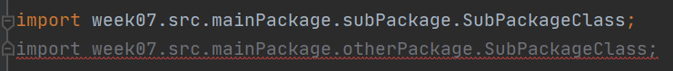

# 목표

자바의 패키지에 대해 학습하세요.

# 학습할 것

- package 키워드
- import 키워드
- 클래스패스
- CLASSPATH 환경변수
- -classpath 옵션
- 접근지시자

---

### package 키워드

Package란..?
> 서로 관련이 있는 클래스 또는 인터페이스들을 묶어 놓은 묶음이다. 
>
> 패키지를 사용함으로써 클래스들이 필요할 때문 사용될 수 있도록하고, 
>
> 클래스를 패키지이름과 함께 계층적인 형태로 사용함으로써 
>
> 다른 그룹에 속한 클래스와 발생할 수 있는 클래스 이름간의 충돌을 막아줌으로 
>
> 클래스의 관리를 편하게 해준다.  

[출처] <https://programmers.co.kr/learn/courses/5/lessons/172>

평소 PC의 파일을 정리 할때 디렉토리를 만들고 그안에 주제별로 디렉토리를 만들고 관련된 자료들끼리 모아서 관리를 한다.

이러한 경험을 다들 있을것이다.

그리고 이러한 방법이 나중에 파일을 찾을때도 찾기도 쉬우며 연관된 자료도 찾기가 편하다.

바로 이런게 패키지라고 생각하면된다.

스터디의 주제를 주차별로 나누었고 그안에 img나 src의 디렉토리를 통하여 구분하였다.

자바의 패키지는 이렇게 연관된것들끼리의 집합이라고 보면된다.

그리고 클래스는 해당 Class가 어디 패키지의 위치에 있는지 자신의 위치를 package 키워드를 통하여 알려준다.

package 레벨의 구분은 . 을 통하여 구분한다.

---

### import 키워드

패키지를 사용하면 연관된 자료들끼리 관리를 하게되므로 소스관리가편해진다.

그럼 만약 다음과 같은 경우는 어떻게 할까?

패키지명이 다른 경로에 동일한 이름의 SUbPackageClass가 존재한다.

그리고 

MainPackageClass에서 SubPackageClass를 호출하려고 한다.
하지만 컴파일 에러가 발생한다..

이유는 바로 MainPackageClass에서 어떤 SubPackgeClass를 사용해야하는지도 헷갈리고
SubPackgeClass의 경로도 파악이 안되기 때문이다.

그렇기 때문에 사용하려는 Class가 어디에 있는 클래스인지 경로를 알려줘야한다.

packge키워드와 마찬가지고 패키지레벨의 구분은 . 을 통하여 표시한다.

---

### import를 사용하지 않는 방법

만약 동일한 클래스명이지만 꼭 그 클래스를 둘다 사용해야할 경우

과연 방법은 없을까?

Main클래스에서 otherPackage와 SubPackage의 SubPackageClass를 참조하고싶다.

import를 둘다 선언하자

둘다 선언하게 되면 SubPackageClass는 이미 import되어 있다고 컴파일 에러가 발생한다.

그럼 정말 방법은 없는것일까....

답은 아니다.

해당 클래스를 코드에서 패키지 경로 포함하여 작성하면된다.

(package경로가 길어.... 변수 타입선언이 좀 지져분해진다..)

---

### 클래스패스

> 패스 (Path)는 경로의 의미를 지닌다.
>
> 즉 클래스 패스는 "클래스의 경로(클래스가 존재하는 경로)"를 뜻하는 것이다.
>
> 자바 가상 머신은 프로그램의 실행과정에서 실행에 필요한 클래스를 찾을때, 바로 이 클래스 패스를 기준으로 찾게된다.

[출처] 난 정말 JAVA를 공부한 적이 없다구요 - 윤성우 저 

간단한 예제를 만들어 실행해보자

메시지를 전달하면 해당 메시지를 출력하는 간단한 기능을 하는 클래스와

해당 메소드를 호출하는 클래스이다

이 두 클래스를 컴파일하게되면

다음의 파일이 생성되고 이를 실행하면 Hello라고 출력을 하고있다.

그럼 SamplePrintFinction 이 클래스를 lib 디렉토리로 옴겨보자.

그리고 실행

자바에서는 SamplePrintFunction 클래스의 위치가 어디인지 모르기 때문에 클래스를 못찾는 에러를 발생한다.

바로 이럴때 클래스의 위치가 어디인지 알수 있도록 ClassPath가 필요한것이다.

---

### CLASSPATH 환경변수

자바를 처음 배우다 보면 환경변수 셋팅에 대해 다들 접해볼것이다.

환경변수를 셋팅하지 않았을경우 

다음과 같은 에러를 모두 접하게되는데.

이는 운영체제에서 javac 컴파일러에 대해 경로가 어디인지 파악을 못해서 발생하는것이다.

윈도우의 경우

설정 -> 고급 시스템설정 -> 고급탭에서 환경변수 클릭 -> 환경변수중 path에 경로를 추가해주면된다.

그럼 환경변수를 셋팅된걸 확인할수 있다.

---

### -classpath 옵션

클래스패스를 지정하는 방법은 실행할때 옵션을 주는 방법도 있다.

SamplePrintFunction을 lib의 디렉토리에 이동한 채로 실행을 할경우 해당 클래스를 못찾아서 에러가 발행하였다.

이럴때 -classpath 옵션을 사용하면 해당 클래스를 인식할수 있다.

---

### 접근지시자

과거 변수를 스터디 할때도 전근제어지시자에 대해 나왔었다..

| 종류 | 클래스내부 | 동일패키지 | 상속받은 클래스 | 이외의영역 | 
| :--- | :--- | :--- | :--- | :--- |
| private | O | X | X | X |
| default(생략가능) | O | O | X | X |
| protected | O | O | O | X |
| public | O | O | O | O | O |

변수에서는 private는 같은 클래스 내부에서만 접근하였고, protected는 상속받았을 경우만 접근이 가능하였다.

하지만 생각해보자.. 클래스는 과연?

private 같은 클래스내에만 가능... 이런거는 불가능하지 않은가...
protected 이것도 사실 클래스에서는 말이 안된다.

즉 클래스에서의 접근시키자는 public과 default인 경우만 존재한다.

public의 경우는 어떠한 패키지에서든 접근이 가능하고 default의 경우는 동일한 패키지 내에서만 접근이 가능하다.
사실 default도 불가능하고 아예 생략을 해야한다.

그리고 public은 같은 java 파일 내에 여러 class가 정의되어 있다면 하나의 class만 public으로 선언이 가능하다. 

---

7주차 과제 참조

[출처] 난 정말 JAVA를 공부한 적이 없다구요 - 윤성우 저 

