# 목표

자바의 인터페이스에 대해 학습하세요.

# 학습할 것

- 인터페이스 정의하는 방법
- 인터페이스 구현하는 방법
- 인터페이스 레퍼런스를 통해 구현체를 사용하는 방법
- 인터페이스 상속
- 인터페이스의 기본 메소드 (Default Method), 자바 8
- 인터페이스의 static 메소드, 자바 8
- 인터페이스의 private 메소드, 자바 9

---

### 인터페이스 정의하는 방법

자바에서 인터페이스를 정의하는 방법을 알아보자
<pre>
public interface ExampleService {

    public static final int serviceId = 1000;
    public abstract void printMessage();
    public abstract void printMessage(String text);
    default void printMessage(String text, LocalDateTime sendTime) {

    };
}
</pre>

인터페이스를 정의하는 방법은 Class를 정의하는 방법과 크게 다르지 않다.
먼저 class 대신 interface로 선언을 하고 메소드선언하면 된다.

인터페이스의 제약사항이 있는데
- 모든 멤버변수는 public static final 이어야하며, 이를 생략이 가능하다.
- 모든 메서드는 public abstract 이어야 하며, 이를 생략 가능하다.

이 두가지 이다.. (평소 저 둘을 다 생략하고 사용해서 사실 이부분이 낯설었다..)

---

### 인터페이스 구현하는 방법

인터페이스는 스스로 인스턴스를 생성할수가 없다. 
그래서 클래스를 통하여 구현을 해야한다.

클래스에서 구현하기 위해서는 단어뜻 그대로 구현이라는 implements를 사용하면된다.

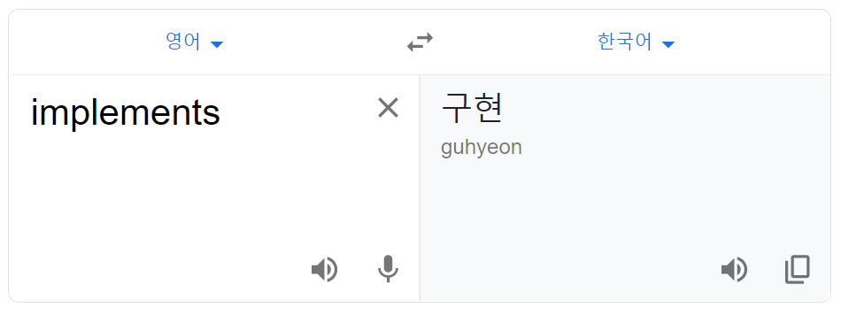

<pre>
public class ExampleServiceImpl implements ExampleService {

    @Override
    public void printMessage() {
        System.out.println("ExampleService 인터페이스의 구현체");
    }

    @Override
    public void printMessage(String text) {
        System.out.println("전송할 메시지는 ["+text+"] 입니다.");
    }
}
</pre>

인터페이스를 구현하게되면 IDEA에서는 컴파일에러가 나며 인터페이스의 추상메소드를 구현하라고 뜬다.

그리고 IDAE제공하는 자동완성기능으로 구현을 하게되면 interface의 추상메소드를 @Override 한다고 나온다.

---

### 인터페이스 레퍼런스를 통해 구현체를 사용하는 방법

그럼 인터페이스를 사용하는방법을 알아보도록 하자.

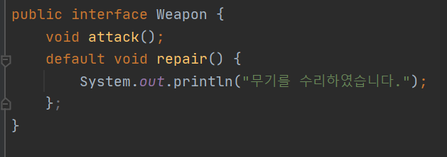

먼저 무기라는 인터페이스를 생성하였다.
그안에는 공격하는 추상메소드를 생성하였고 수리를 하는 default 메서드를 생성하였다.

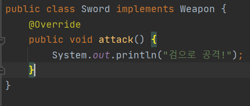

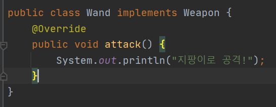

이 Weapon이라는 무기 인터페이스를 검과 지팡이로 구현해 해보자

그리고 이를 사용하기 위해서

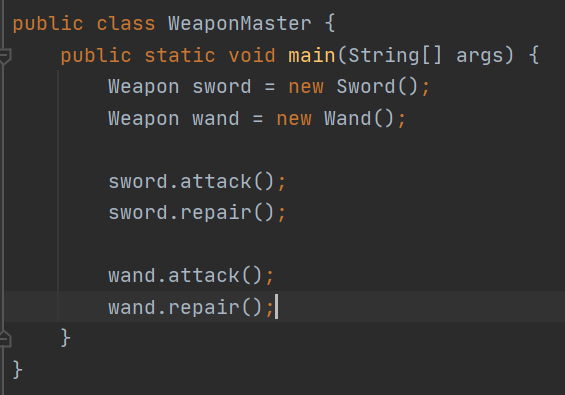

Weapon의 타입으로 각각 구현체를 생성하였다.

이 각각의 변수를 통하여 attack(); 과 repair(); 를 호출하면

각 구현한 메소드와 Weapon에 구현한 default 메서드가 실행되는것을 확인할수 있다.

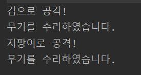

Weapon인터페이스를 통하여 Sword, Wand의 객체를 생성후에 사용이 가능하다.

---

### 인터페이스 상속

인터페이스의 상속... 곰곰히 생각하다가 Java의 Collection이 생각났다.

<pre>
Collection list = new ArrayList();
</pre>

ArrayList는 Java의 List 인터페이스를 구현한 구현체이다.

ArrayList를 확인해보면 List를 구현한다는것을 확인할수 있다.

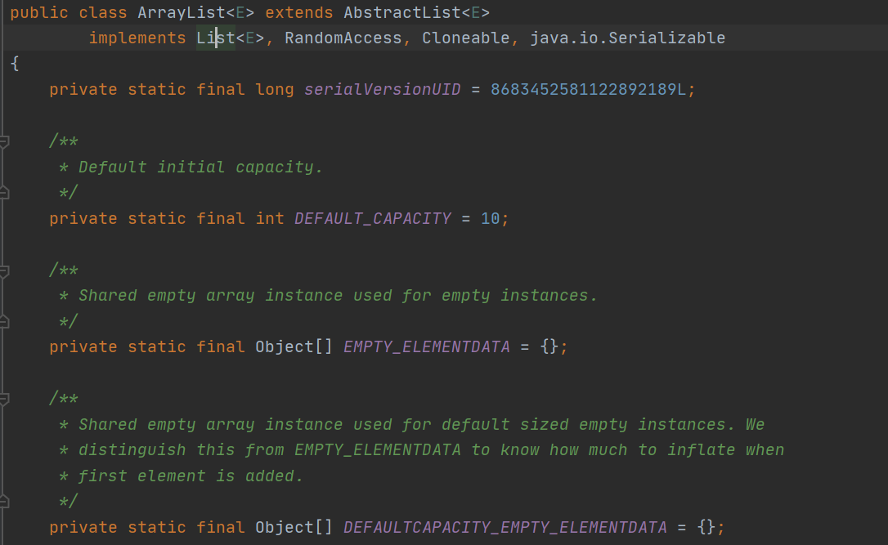

구현 List의 인터페이스를 한번 살펴보면

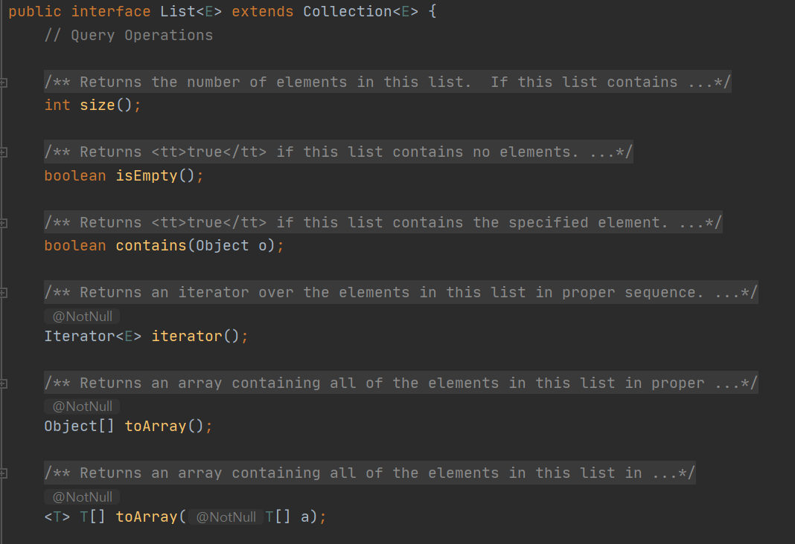

자바의 자료형이 최상위의 Collection이 나온다.

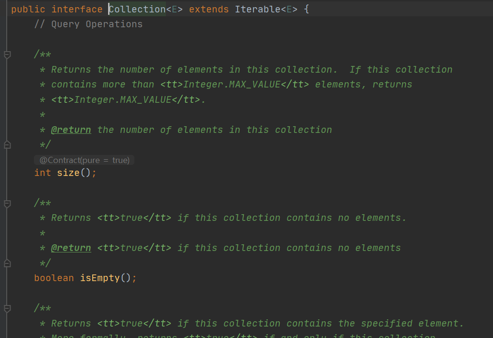

이렇게 보다보니.. 많이 낯익은 메소드들이 많이보인다.

size().. isEmpty().. 이 메소드들은 최상위 Collection에 정의되어 있고 각 자바의 Collection 구현체(list, set 등등)

에서 각 자료구조에 맞게 구현하여 사용하고 있는것이다.

---

### 인터페이스의 기본 메소드 (Default Method), 자바 8

인터페이스의 default Method를 이번에 처음 알게되었다...
(자바8의 특징으로 하나더 추가해야겠다...)

weapon인터페이스에서 attack 이라는 추상메소드를 선언하고 있다.
그리고 default Method를통하여 공통으로 사용되는 기능을 구현하였다.

이처럼 default Method를 사용하게되면 인터페이스의 구현체를 사용하지 않고도 새부내용을 구현할수가 있다.

(물론 사용은 구현체를 생성하여 사용해야한다,)

---

### 인터페이스의 static 메소드, 자바 8

default 메소드처럼 static 메소드가 추가되었다.

사용법은 default 메소드와 다르지 않다. 단지 default 대신 static으로 사용하면된다.

차이점은 default 메소드의 경우 해당 메소드를 오버라이딩이 가능하다.

하지만 static의 경우는 오버라이딩이 불가능하다는 점이 차이점이다.

---

### 인터페이스의 private 메소드, 자바 9

인터페이스에서 private 메소드는 자바9에서 나왔다.

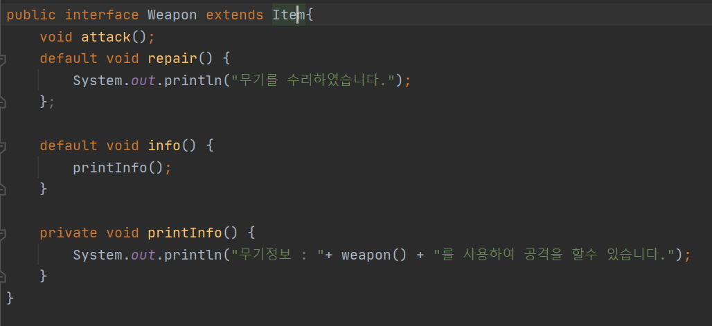

private 이건 동일한 class 내부에서만 접근이 가능하도록 하였던 접근제어자 였다.

역시 인터페이스에서도 외부가 아닌 자기자신의 인터페이스에서 사용을 하도록 추가가된것이다.

이는 java8로 오면서 인터페이스내에서 메소드의 구현이 가능해졌기 때문에

외부에서 접근을 적절하게 막고자 private를 만든다 아닌가 싶다..

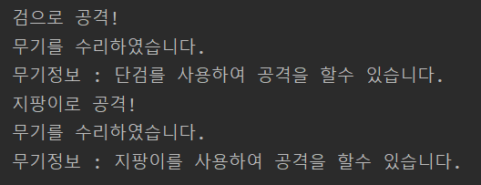

현재도 업무가 1.6 1.7이 아직 주를 이루고... 최근들어 1.8 Java로 개발을 하고 있다.

공부를 하면서 Java9 또는 11을 접해보고 있는데.. 이번기회에 JDK버전별 차이좀 공부해둬야겠다..

---

8주차 과제 참조

[출처] 난 정말 JAVA를 공부한 적이 없다구요 - 윤성우 저 

