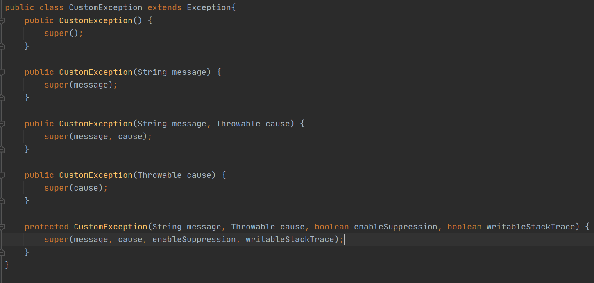

# 목표

자바의 예외 처리에 대해 학습하세요.

# 학습할 것

- 자바에서 예외 처리 방법 (try, catch, throw, throws, finally)
- 자바가 제공하는 예외 계층 구조
- Exception과 Error의 차이는?
- RuntimeException과 RE가 아닌 것의 차이는?
- 커스텀한 예외 만드는 방법

---

### 자바에서 예외 처리 방법 (try, catch, throw, throws, finally)

자바에서 예외처리하는 방법을 알아보자..

> try~catch

<pre>
try {
    ...
} catch(예외1) {
    ...
} catch(예외2) {
    ...
...
}
</pre>

try~catch 문은 try 안의 내용을 수행하다가 예외가 발생했을경우 catch 말그대로 잡는것이다.

try 블록 안에서 정상적으로 처리가 되면 catch문은 패스하게된다.

하지만 try블록안에서 예외가 발생할 경우

<pre>
int c;
try {
    c = 4 / 0;
}catch(ArithmeticException e) {
    c = -1;
}
</pre>

0 으로 나누었을 경우 ArithmeticException 예외가 발생하게되어 c = -1 로 저장된다.
이처럼 내용을 정상적으로 처리하다가 그 해당 상황을 뒷수습(?) 해주는 방법이 try~catch 처리인것이다.

> finally

try 문에서 예외가 발생하면 그 뒤의 내용은 실행이 안된다.

<pre>
try {
    c = 4 / 0;    << 예외발생
    test.shouldBeRun();
} catch (ArithmeticException e) {
    c = -1;
}
</pre>

이처럼 예외가 발생하면

test.shouldBeRun();

이부분은 실행이 안될것이다.
 
이때 이러한 부분을 실행하기위해 finally이 존재한다.

<pre>
try {
    c = 4 / 0;   << 예외발생
} catch (ArithmeticException e) {
    c = -1;
} finally {
    test.shouldBeRun();    << try~catch 문이 끝날때 반듯이 실행
}
</pre>

finally문은 try~catch 문이 끝날때 실행된다.

즉 정상적으로 실행되어도 실행되고 

예외가 생겨 도중에 catch문으로 넘어간뒤에도 마지막에 실행되는 영역이다.

> throw 

throw 말그대로 던지는것이다.
throw를 사용하면 예외를 발생할수가 있다.

<pre>
String myName = "hJJANG";
try {
    if(!myName.equals("hJ")) {
        throw new CustomException("이름이 hJJANG이 아닙니다.");
    }    
}catch (CustomException e){
    System.out.println("에외발생!!!");
}
</pre>

간단한 샘플 예제를 보자
이름이 일치하지 않을 경우 throw를 통하여 예외를 발생할수가 있다.

> throws

throw는 예외를 발생하는건데... throws는 무엇인가..
throws는 메서드에 선언하는 것이고 호출한 메소드에 예외처리를 던지는것이다.

<pre>
public static void main(String[] args) {
    ExceptionExample example = new ExceptionExample();
    
    example.customException2();
}

...

public void customException2() throws Exception {
    String myName = "hJJANG";
    
    if(myName.equals("xxxx")) {
        throw new Exception("잘못된 이름");
    }
}
</pre>

throw로 발생된 예외를 throws로 상위 메소드로 던져보자

해당 메소드를 try~catch로 잡아야한다고 컴파일 에러가 발생할 것이다.

<pre>
try {
    example.customException2();
} catch (Exception e) {
    System.out.println("예외처리");
}
</pre>

---

### 자바가 제공하는 예외 계층 구조

[출처] <https://www.javamadesoeasy.com/2015/05/exception-handling-exception-hierarchy.html>

자바의 예외는 Exception과 Error로 크게 나누어 지고
Exception 내부에서도 checkedException과 uncheckedException으로 나누어 진다.

> RuntimeException을 상속하지 않는 클래스는 CheckedException,
> 반대로 상속한 클래스는 UncheckedException으로 분류할 수 있다.

[출처] <https://madplay.github.io/post/java-checked-unchecked-exceptions>

CheckedException은 라이브러리나 코드등에서 해당 기능을 사용할때 예외가 발생할 수 있으니 
예외처리를 해야한다고 사용자에게 말해주는것이다. 
즉 이부분은 예외 체크를 해라 라고 말해준다고 보면된다.
(이부분을 지금까지 왜 반대로 이해하고 있었을까..이부분은 체크가된 익셉셥 이런느낌으로 왜 머리에 들어가 있었는지 모르겠다.)

UncheckedException는 라이브러리나 코드등에서 해당 기능을 사용할때 예외가 발생할수 있지만. 
처리할 방법이 없으니 상위 호출한곳에 던지라는 의미이다.
대표적인게 NullPointerException이 있다.

[출처] <https://madplay.github.io/post/java-checked-unchecked-exceptions>

---

### Exception과 Error의 차이는?

Exception은 개발자가 프로그래밍을 하다가 이런부분을 처리해야겠다고 예외를 선언하여 발생하는 경우이다.
하지만 Error는 계층 이미지에서도 불수 있듯이 ThreadDeath, VirtualMachineError, IOError등 소스레벨에서 처리할수 있는게 
아닌 시스템레벨에서 처리를 해야하는 에러이다.

---

### RuntimeException과 RE가 아닌 것의 차이는?

컴파일시의 예외처리를 체크 하냐 안하냐의 차이이다.

컴파일러는 RuntimeException을 제외한 모든 Exception을 컴파일시에 예외처리했는지를 확인한다.
하지만 RuntimeException의 예외는 try~catch를 사용안해도 컴파일이 가능하다.

그럼 왜 이렇게 만들었는가?
> RuntimeException에 속하는 클래스들은 주로 개발자의 실수에 의해 발생되는 예외가 많다.
> 예를 들어 ArithmeticException(0으로 나누기) , IndexOutOfBoundsException(배열범위) 등이 있다. 이런 것들은 개발자가 조금만 더 신경쓰면 예외가 발생하지 않게끔 해줄수 있기에 컴파일러가 확인하지 않게 되었다라고 볼수도 있다(정확한 이유는 java만든 사람에게 문의를..)
          
[출처] Exception, RuntimeException의 개념과 사용 용도|작성자 serverwizard <https://madplay.github.io/post/java-checked-unchecked-exceptions>

---

### 커스텀한 예외 만드는 방법

커스텀 익셉션을 만드는 방법은 커스텀Exception클래스를 생성한 후에 Exception을 상속받아서 사용하면 된다.

---

예외처리... 평소 try~catch로 묶어 처리를 자주 하였지만, 그동안 잘못된 사용이나 잘못 알고 있던게 있었다..
이번 예외시간을 계기로 다시한번 제대로 정리를 할 수 있어서 좋았다..
(원래는 스프링 트랜잭션 관련도 정리를 하려고했는데... 다른업무 일정때문에 그부분은 추후에 정리를 해야겠다.)

