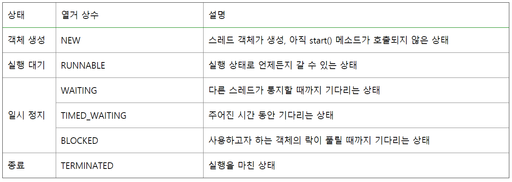
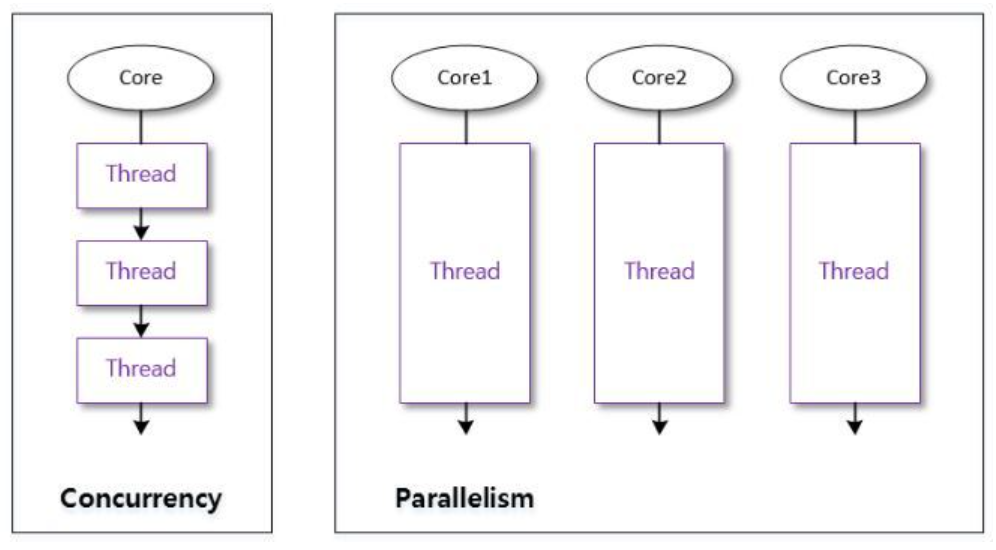
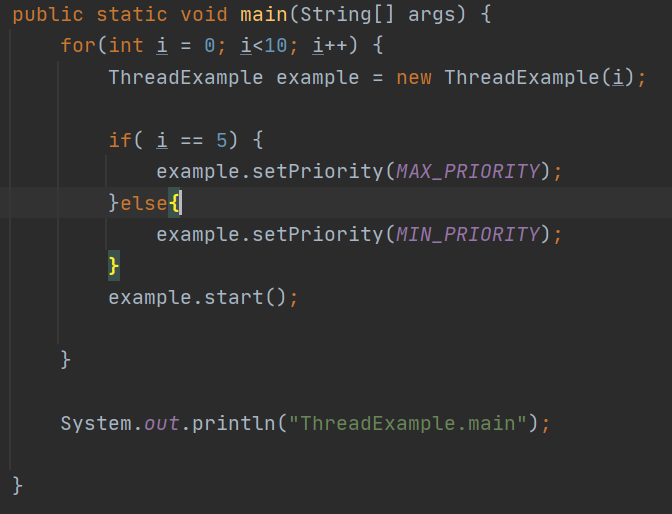
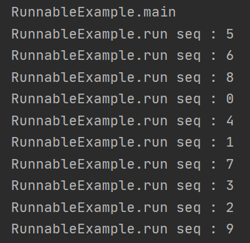
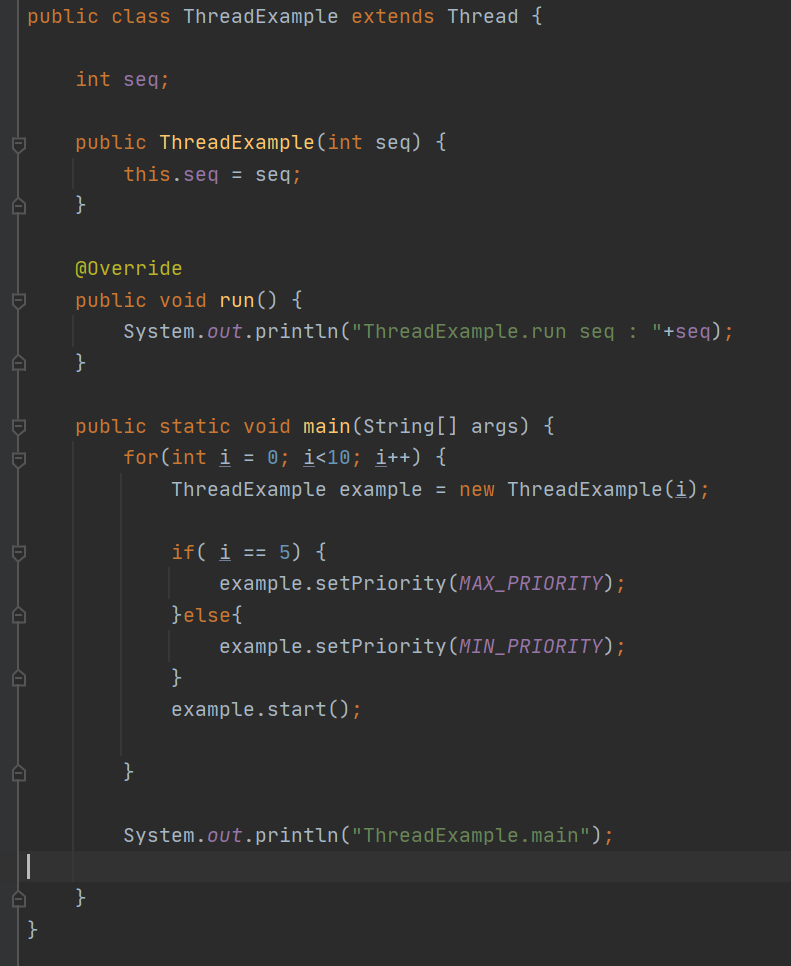
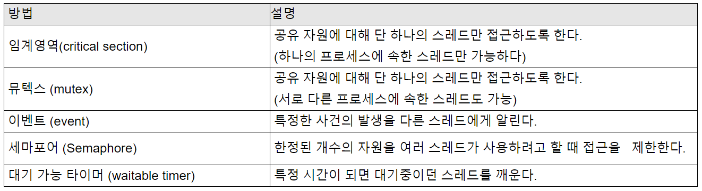

# 목표

자바의 멀티쓰레드 프로그래밍에 대해 학습하세요.

# 학습할 것

- Thread 클래스와 Runnable 인터페이스
- 쓰레드의 상태
- 쓰레드의 우선순위
- Main 쓰레드
- 동기화
- 데드락

---

### Thread 란?

동작하고 있는 프로그램을 프로세스라고 하며 하나의 프로세스는 한가지의 일을 한다.

쓰레드를 이용하면 프로세스 내에서 두가지 또는 이상의 일을 동시에 할수 있게된다.

[출처] <https://wikidocs.net/230>

### Thread 클래스와 Runnable 인터페이스

자바에서 쓰레드를 생성하는 방법은 Thread를 상속받는 방법과 Runnable Interface를 구현하는 방법이있다.

1. Thread를 상속받아서 생성하는방법 
<pre>
public class ThreadExample extends Thread {

    int seq;

    public ThreadExample(int seq) {
        this.seq = seq;
    }

    @Override
    public void run() {
        System.out.println("ThreadExample.run seq : "+seq);
    }

    public static void main(String[] args) {
        for(int i = 0; i<10; i++) {
            ThreadExample example = new ThreadExample(i);
            example.start();
        }

        System.out.println("ThreadExample.main");

    }
}
</pre>

2. Runnable Interface를 구현하는 방법 
<pre>
public class RunnableExample implements Runnable {

    int seq;

    public RunnableExample(int seq) {
        this.seq = seq;
    }

    @Override
    public void run() {
        System.out.println("RunnableExample.run seq : "+seq);
    }

    public static void main(String[] args) {
        for(int i = 0; i<10; i++) {
            Thread thread = new Thread(new RunnableExample(i));
            thread.start();
        }

        System.out.println("RunnableExample.main");

    }
}
</pre>

---

### 쓰레드의 상태

Thread의의 상태는 크게 6가지가 있다.

[출처] <https://widevery.tistory.com/27>

Thread의 상태는 getState() 메소드를 사용하면 확인할수 있으며 해당 상태는 Thread 클래스 내부에 Enum으로 정의되어있는것을 확인할수가 있다.

<pre>
public enum State {
        /**
         * Thread state for a thread which has not yet started.
         */
        NEW,

        /**
         * Thread state for a runnable thread.  A thread in the runnable
         * state is executing in the Java virtual machine but it may
         * be waiting for other resources from the operating system
         * such as processor.
         */
        RUNNABLE,

        /**
         * Thread state for a thread blocked waiting for a monitor lock.
         * A thread in the blocked state is waiting for a monitor lock
         * to enter a synchronized block/method or
         * reenter a synchronized block/method after calling
         * {@link Object#wait() Object.wait}.
         */
        BLOCKED,

        /**
         * Thread state for a waiting thread.
         * A thread is in the waiting state due to calling one of the
         * following methods:
         * <ul>
         *   <li>{@link Object#wait() Object.wait} with no timeout</li>
         *   <li>{@link #join() Thread.join} with no timeout</li>
         *   <li>{@link LockSupport#park() LockSupport.park}</li>
         * </ul>
         *
         * 
A thread in the waiting state is waiting for another thread to
         * perform a particular action.
         *
         * For example, a thread that has called {@code Object.wait()}
         * on an object is waiting for another thread to call
         * {@code Object.notify()} or {@code Object.notifyAll()} on
         * that object. A thread that has called {@code Thread.join()}
         * is waiting for a specified thread to terminate.
         */
        WAITING,

        /**
         * Thread state for a waiting thread with a specified waiting time.
         * A thread is in the timed waiting state due to calling one of
         * the following methods with a specified positive waiting time:
         * <ul>
         *   <li>{@link #sleep Thread.sleep}</li>
         *   <li>{@link Object#wait(long) Object.wait} with timeout</li>
         *   <li>{@link #join(long) Thread.join} with timeout</li>
         *   <li>{@link LockSupport#parkNanos LockSupport.parkNanos}</li>
         *   <li>{@link LockSupport#parkUntil LockSupport.parkUntil}</li>
         * </ul>
         */
        TIMED_WAITING,

        /**
         * Thread state for a terminated thread.
         * The thread has completed execution.
         */
        TERMINATED;
    }
</pre>

---

### 쓰레드의 우선순위

멀티 쓰레드는 동시성 또는 병렬성으로 실행된다.

1. 동시성
> 동시성은 멀티 작업을 위해 하나의 코어에서 멀티 쓰레드가 번갈아가며 실행하는 설징을 말한다.

2. 병렬성
> 멀티 작업을 위해 멀티코어에서 개별쓰레드를 동시에 실행하는 성질을 말한다.

* 싱글코어CPU를 이용한 멀티 스레드 작업은 병렬적으로 실행되는것처럼 보이지만, 번갈아가며 실행하는 동시성 작업이다.

[출처] <https://deftkang.tistory.com/56>

- 자바의 쓰레드 스케쥴링은 우선순위(Priority) 방식과 순환할당(Round-Robin) 방식을 사용한다.

Thread에 setPriority를 이용해서 Thread의 우선순위를 지정할수 있다.

가장높은 우선순위를 지정한 5번쓰레드가 가장 먼저 실행된것을 확인할수 있다.

---

### Main 쓰레드

메인스레스는 main()메소드를 실행하면서 시작된다.
main메소드의 코드흐름이다. 메인스레드가 없다면 멀티스레드가 나올수 없다.

main함수에서 시작되는 쓰레드가 main쓰레드이고 그 안에서 생성되서 동작하는 쓰레드가 새로 생성한 작업쓰레드들이다.

이 모든 쓰레드를 합쳐서 멀티쓰레드라 한다.

[출처] <https://gosmcom.tistory.com/19>

---

### 동기화

Thread의 동기화를 위해서 임계영역과 잠금을 사용한다.
임계영역을 지정하고 임계영역이 가지고 있는 lock을 단 하나의 쓰레드에게 빌려주는 개념이다.
lock은 단하나의 쓰레드만이 가질수 있고 임계영역어 내에서 수행할 코드를 수행한 이후에는 lock을 반납해야한다.

- 동기화를 해야하는 이유
> 멀티쓰레드 환경에서는 여러쓰레드가 자원을 공유할수 있다. 이과정에서 원래 의도와는 다르게 예측범위밖의 실행결과가 발생할수가 있다.

- synchronized를 이용한 동기화
1. 메서드 전체를 임계영역으로 설정한다.
2. 특정한 영역을 임계영역으로 설정한다. (객체의 참조변수)

- 메소드 동기화
<pre>
synchronized void test() {
    ...
}
</pre>

- 객체 동기화
<pre>
synchronized(객체 참조변수) {
    ...
}
</pre>
[출처] <https://kyun2.tistory.com/12>

---

### 데드락

운영체제에서 시스템자원에 대한 요구가 뒤엉킨 상태를 말한다.

둘 이상의 프로세스가 다른프로세스가 점유하고 있는 지원을 서로 기다릴 때 무한대기에 빠지는 상황을 말한다.

- 데스락 발생조건
1 . 상호배제
> 한번에 프로세스 하나만 해당 자원을 사용할수 있다. 사용중인 자원을 다른 프로세스가 사용하려면 요청한 자원이 해제될때까지 기다려야한다.

2 . 점유대기
> 자원을 최소한 하나 보유하고, 다른 프로세스에 할당된 자원을 점유하기 위해 대기하는 프로세스가 존재해야한다.

3 . 비선점
> 이미 할당된 자원을 강제로 빼알을수 없다.

4 . 순환대기
> 대기 프로세스의 집합이 순환형태로 자원을 대기하고 있어야한다.

- 데드락의 해결법

1 . 데드락이 발생하지 않도록 예방

2 . 데드락 발생 가능성을 인정하면서도 적절하게 회피

3 . 데드락 발생을 허용하지만 데드락을 탐지하여 데드락에서 회복

[출처] <https://chanhuiseok.github.io/posts/cs-2/>

---

