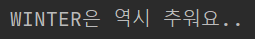
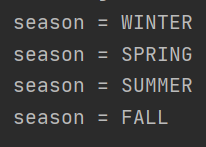
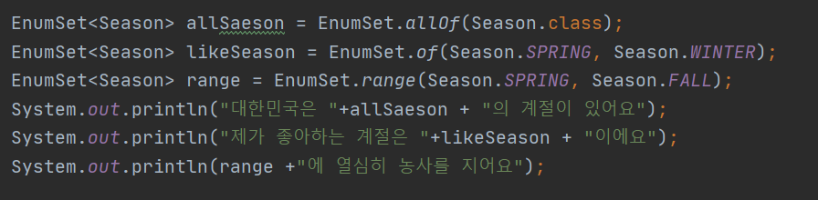

# 목표

자바의 열거형에 대해 학습하세요.

# 학습할 것

- enum 정의하는 방법
- enum이 제공하는 메소드 (values()와 valueOf())
- java.lang.Enum
- EnumSet

---

### enum 정의하는 방법

열거체(enumeration type)
> C언어와 C++에서는 열거체를 사용할 수 있지마느 JDK1.5이전의 자바에서는 열거체를 사용할 수 없었습니다.
> 하지만 JDK1.5부터는 C언어의 열거체보다 더욱 향상된 성능의 열거체를정의한 Enum클래스를 사용할 수 있습니다.

[출처] <http://www.tcpschool.com/java/java_api_enum>

<pre>
public enum Season {
    WINTER, SPRING, SUMMER, FALL
}
</pre>

class 대신 enum으로 선언한뒤 정의할 상수들을 나열하면된다.

Enum을 사용하기 위해서는

Enum의이름.값 의 형태로 사용할수 있다.

<pre>
...
System.out.println(Season.WINTER + "은 역시 추워요..");
...
</pre>

---

### enum이 제공하는 메소드 (values()와 valueOf())

1. values()
> values() 는 Enum 클래스가 가지고 있는 모든 상수 값을 배열의 형태로 리턴한다.
> 참고로 단순히 String 의 형태로 단순 반환하는 것이 아니라 인스턴스를 반환하는 것이다.
> 즉 Enum클래스가 가지고 있는 모든 인스턴스를 배열에 담아 반환하는 것이다.

values() 말그대로 해당 Enum의 값들 이라는 의미이다.

<pre>
...
Season[] seasons = Season.values();
for (Season season : seasons) {
    System.out.println("season = " + season);
}
...
</pre>

위 예시를 한번 돌려보자.
앞서 정의했던 Season Enum 클래스의 values()를 호출하면(값들을) 다음과 같이 Enum클래스에 정의된 값들이 출력된다.

2.valueOf()
> valueOf() 메서드는 String을 파라미터로 받는데 인자로 들어온 String과 일치하는 상수 인스턴스가 존재하면 그 인스턴스를 반환한다.
> 이또한 마찬가지로 단순히 문자열을 반환하는것이 아니라 인자로 들어온 문자열과 일치하는 인스턴스를 반환하는 것이다.

valueOf() 를 말하면 ~~의 값이라고 말할수가 있다. 즉 String으로 입력받은 값의 Enum클래스를 반환 받는것이다.
이것은 Enum말고도 다른곳에서도 봤을꺼라 생각한다. 그중 하나가 String의 valueOf()이다

<pre>
String pi = String.valueOf(3.14);
System.out.println(pi);
</pre>

String의 valueOf 역시 입력받은 값을 String으로 반환해주는 것이다.

그럼 다시 Enum으로 넘어와 보자

<pre>
Season season = Season.valueOf("SPRING");
System.out.println("2달뒤면..." + season)
</pre>

SPRING이라는 문자열에 해당하는 Enum을 반환해준다.

[출처] <https://velog.io/@kyle/%EC%9E%90%EB%B0%94-Enum-%EA%B8%B0%EB%B3%B8-%EB%B0%8F-%ED%99%9C%EC%9A%A9>

---

### java.lang.Enum

> Enum 클래스는 모든 자바 열거체의 공통된 조상 클래스입니다.
> Enum 클래스에는 열거체를 조작하기 위한 다양한 메소드가 포함되어 있습니다.

[출처] <http://www.tcpschool.com/java/java_api_enum>

---

### EnumSet

EnumSet은 말그래도 열거형들의 Set이라는 소리이다.
아마도 다음 예시를 보면 이해가 좀더 빠르게 될것이다.

<pre>
EnumSet<Season> allSaeson = EnumSet.allOf(Season.class);
EnumSet<Season> likeSeason = EnumSet.of(Season.SPRING, Season.WINTER);
EnumSet<Season> range = EnumSet.range(Season.SPRING, Season.FALL);
System.out.println("대한민국은 "+allSaeson + "의 계절이 있어요");
System.out.println("제가 좋아하는 계절은 "+likeSeason + "이에요");
System.out.println(range +"에 열심히 농사를 지어요");
</pre>

> 열거할 수 있는 타입을 한데 모아 집합 형태로 사용한다고해도 비트 필드를 사용할 이유는 없다.
> EnumSet 클래스가 비트 필드 수준의 명료함과 성능을 제공하고 열거타입의 장점까지 선사하기 때문이다.
> EnumSet의 유일한 단점이라면 불변 EnumSet을 만들수 없다는 것이다.  

[출처] Effective Java 3/E

---
