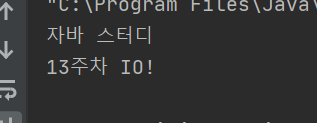
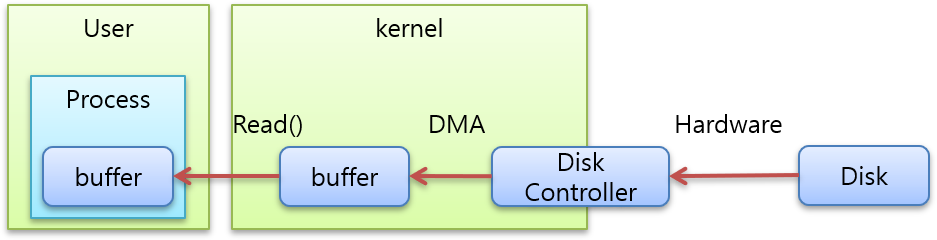

# 목표

자바의 Input과 Ontput에 대해 학습하세요.

# 학습할 것

- 스트림 (Stream) / 버퍼 (Buffer) / 채널 (Channel) 기반의 I/O
- InputStream과 OutputStream
- Byte와 Character 스트림
- 표준 스트림 (System.in, System.out, System.err)
- 파일 읽고 쓰기
- Java IO가 느린이유

---


### 스트림 (Stream) / 버퍼 (Buffer) / 채널 (Channel) 기반의 I/O

- stream
> 스트림이란 프로그램과 I/O 객체를 연결하여 데이터를 송수신 하는 길을 말한다.
> InputStream은 데이터를 읽어 들이는 객체이고, OutputStream은 데이터를 써서보내는 객체이다.

- Buffer
> 버퍼를 나타낸다. 기본 데이터 타입에 대한 버퍼가 각각 존재하며 입출력 데이터를 임시로 저장할 때 사용된다.

- Channel
> 데이터가 통과하는 스트림을 나타낸다. 소켓, 파일, 파이프등 다양한 입출력 스트림에 대한 채널이 존재한다.


[출처] <https://victorydntmd.tistory.com/134>
[출처] <https://javacan.tistory.com/entry/73>

---

### InputStream과 OutputStream

- 단 방향으로 연속적이게 흘러가는 형태 : 출발지에서 나와서 도착지로 들어감
- 프로그램이 출발지냐 도착지냐에 따라 스트림 종류가 다름

1) 도착지 : 입력 스트림
2) 출발지 : 출력 스트림

- 프로그램이 네트워크 상의 다른 프로그램과 데이터 교환을 위해 두 스트림이 모두필요

1 . InputStream

| 클래스 | 설명 | 
| :--- | :--- |
| InputStream | 바이트 입력 스트림을 위한 추상 클래스 |
| FileInputStream | 파일에서 바이트를 읽어들여 바이트 스트림으로 변환 |
| PipedInputStream | PipedOutputStream에서 읽어들임 |           
| FilterInputStream | 필터 적용(filtered) 바이트 입력을 위한 추상 클래스  | 
| LineNumberInputStream | 바이트 입력시 라인 번호를 유지 (비추천)   |      
| DataInputStream | 기본 자료형 데이터를 바이트로 입력     |              
| BufferedInputStream | 바이트 버퍼 입력                |         
| PushbackInputStream | 읽어들인 바이트를 되돌림 (pushback)    |      
| ByteArrayInputStream | 바이트 배열에서 읽어들임            |        
| SequenceInputStream | 서로 다른 InputStream을 입력받은 순서대로 이어줌  |
| StringBufferInputStream | 문자열에서 읽어들임 (비추천)        |      
| ObjectInputStream | 객체로 직렬화된 데이터를 역직렬화 하여 읽는다.    |      

2 . OutputStream

| 클래스 | 설명 | 
| :--- | :--- |
| OutputStream | 바이트 출력 스트림을 위한 추상 클래스  |
| FileOutputStream | 바이트 스트림을 바이트 파일로 변환  |
| PipedOutputStream | PipedOutputStream에 출력 |
| FilterOutputStream | 필터 적용(filiterd) 바이트 출력을 위한 추상 클래스  |
| DataOutputStream | 바이트를 기본자료형으로 출력 |
| BufferedOutputStream | 바이트 스트림에 버퍼 출력 |
| PrintStream | Stream 값과 객체를 프린트 |
| ByteArrayOutputStream | 바이트 스트림에 바이트 배열 출력 |
| ObjectputStream | 데이터를 객체로 직렬화 하여 출력 |

[출처] <https://hyeonstorage.tistory.com/250>

---

### Byte와 Character 스트림

1 . 바이트 스트림(Byte Stream) --- 한글이 깨찜
    
    InputStream과 OutputStream클래스와 하위 클래스를 이용해 입출력을 수행
    
    XXXInputStream  - 읽기전용 클래스 (1byte)
    
    XXXOutputStream - 쓰기전용 클래스(1byte)

2 . 문자 스트림(Character Stream) 
    
    16비트 문자나 문자열을 읽고 쓰는 스트림으로 Reader나 Writer클래스와 하위 클래스를 이용
    
    XXXReader - 읽기전용 클래스 (2byte, 문자단위)
    
    XXXWriter - 쓰기전용 클래스 (2byte, 문자단위)

[출처] <https://m.blog.naver.com/PostView.nhn?blogId=javaking75&logNo=140162266766&proxyReferer=https:%2F%2Fwww.google.com%2F>


---

### 표준 스트림 (System.in, System.out, System.err)

```java
public final class System {
...
    public static final InputStream in = null;
    
    public static final PrintStream out = null;

    public static final PrintStream err = null;
...
}
```

입력 클래스
System.in

> 한 바이트씩 읽어 들인다. 한글과 같은 여러바이트로 된 문자를 읽기 위해서는 InputStreamReader와 같은 보조스트림을 사용해야한다.

Scanner 클래스
> java.util 패키지에 있는 입력 클래스, 문자뿐 아니라정수, 실수 등 다양한 자료형을 읽을수 있다.

생성자가 다양하여 여러소스로부터 자료를 읽을 수 있다.
- Scanner(File source) : 파일을 매개변수로 받아 Scanner를 생성
- Scanner(InputStream source) : 바이트 스트림을 매개변수로 받아 Scanner를 생성
- Scanner(String source) : String을 매개변수로 받아 Scanner를 생성

```java
Scanner sc = new Scanner(System.in);
```

표준 입력으로부터 자료를 읽어 들이는 기능을 사용할 수 있다.

Scanner 클래스에서 제공하는 메서드

| 메서드 | 설명 |
| :--- | :--- |
| boolean nextBoolean() | boolean 자료를 읽는다. |
| byte nextByte() | 한 바이트 자료를 읽는다. |
| short nextShort() | short 자료형을 읽는다. |
| int nextInt() | int 자료형을 읽는다. |
| long nextLong() | long 자료형을 읽는다. |
| float nextFloat() | float 자료형을 읽는다. |
| double nextDouble() | double 자료형을 읽는다. |
| String nextLine() | 문자열 String을 읽는다. |


[출처] <https://velog.io/@ednadev/%EC%9E%90%EB%B0%94-%EC%9E%85%EC%B6%9C%EB%A0%A5%EA%B3%BC-%EC%8A%A4%ED%8A%B8%EB%A6%BCStream>

---

### 파일 읽고 쓰기

파일 쓰기 방법
```java
public class FileWriterExample {

    public static void main(String[] args) {
        try(
            FileWriter writer = new FileWriter("sample.txt", true);
            BufferedWriter bufferedWriter = new BufferedWriter(writer);
        ) {
            bufferedWriter.write("자바 스터디");
            bufferedWriter.newLine();
            bufferedWriter.write("13주차 IO!");
            bufferedWriter.newLine();
            bufferedWriter.flush();
        } catch (IOException e) {
            e.printStackTrace();
        }

    }
}
```

파일 읽기 방법
```java
public class FileReaderExample {

    public static void main(String[] args) {
        try(
                FileReader reader = new FileReader("sample.txt");
                BufferedReader bufferedReader = new BufferedReader(reader);
        ) {
            String readLine = null;
            while( ( readLine =  bufferedReader.readLine()) != null ){
                System.out.println(readLine);
            }
        } catch (IOException e) {
            e.printStackTrace();
        }
    }
}
```



---

### Java IO가 느린이유

- OS에서 관리하는 커널 버퍼에 직접 접근불가



- 디스크에서 파일 읽는 과정
1. JVM이 파일을 읽기 위해 kernel에 명령 전달
2. Kernel은 시스템ㅋ콜 (read())을 사용
3. 디스크 컨트롤러가 물리적 디스크로부터 파일을 읽어옴
4. DMA를 이용하여 kernel 버퍼로 복사
5. JVM 내부 버퍼로 복사

- 문제점
1. JVM 내부 버퍼로 복사 시 CPU 관여
2. 복사 Buffer 활용 후 GC 대상이 됨
3. 복사 진행중인 동안 IO요청한 Thread가 Blocking


---